---
jupytext:
  cell_metadata_filter: -all
  formats: md:myst
  text_representation:
    extension: .md
    format_name: myst
    format_version: 0.13
    jupytext_version: 1.14.0
kernelspec:
  display_name: Python 3 (ipykernel)
  language: python
  name: python3
---

# Tutorial 1A: From raw data to evoked responses: pre-process MEG & EEG data

In this tutorial, you will go through the initial steps that take you from raw data to evoked responses. These steps are:
1. Import the raw MEG and EEG data.
2. Inspect the data and metadata.
3. Select timelocked data
4. Clean the data by removing artefacts, filter data, and re-reference EEG.

The raw data is stored in the three `fif` files that you have downloaded before beginning the tutorials:

    'tactile_stim_raw_tsss_mc.fif'
    'tactile_stim_raw_tsss_mc-1.fif'
    'tactile_stim_raw_tsss_mc-2.fif'

Note that though there are three data files, they are all part of one single recording session. But because the `fif` format (the file format of the Neuromag MEG/EEG system that we used to record data) only allows files to have a size of up to 2GB, the recording has been split into separate files. We should, therefore, think of these as one single file when we continue to process the data despite there being three files.

This is an important thing to notice when recording data. It illustrates the need for consistent file naming. For the example data, you can see that all are called `tactile_stim`, indicating that it is the same task.

## Import libraries and setup paths
The first step is to point to the path where we have the data. Change these to appropriate paths for your operating system and setup. Here I choose to use paths relative to where the scripts are.

```{python}
#%% Import modules and set up paths
import mne
import os
from os.path import join, exists, expanduser
import numpy as np
import matplotlib.pyplot as plt

# project_path = join(expanduser('~'), 'courses/meeg_course_mne') # Change to match your project path
# meg_path = join(project_path, '../data')   # Change to match your data path
# figs_path = join(project_path, 'figs')

meg_path = '../data'
figs_path = 'figures'

print(os.listdir(meg_path))
print(os.listdir(figs_path))


show_plots = False # Change to True to open plots in browser
```

Then define the subject and recording specific paths. For now, we only have one subject and session. In principle, we could just define the path as one string variable when we only have one subject. But we introduce this already now as it is a good ´way to organize your data when you have multiple subjects or session. In that case, the cell array `subjects_and_dates` can be expanded to include more subjects, simply by adding the subject ids and session names.

```{python}
#%% Define subject paths
# List of all subjects/session

subjects_and_dates = [
    'NatMEG_0177/170424/'  # Add more subjects as you like, separate with comma    
    ]
           
# List of all filenames that we will import                
filenames = [
    'tactile_stim_raw_tsss_mc.fif',
    'tactile_stim_raw_tsss_mc-1.fif',
    'tactile_stim_raw_tsss_mc-2.fif'
            ]

# Define where to put output data
output_path = join(meg_path, subjects_and_dates[0], 'MEG')
```

## First look at what is in the data files
The `fif` files contain everything that was recorded during the recording data, including MEG data, EEG data, triggers, and various metadata. Before you import everything, take a look at what is in the files. This is especially a good idea if you are dealing with large files to avoid that you confidentially read in more data than what your computer can handle.

Now it is time to use the first MNE-Python function: use `mne.io.read_info` to read metadata from the `fif` files. Note that this will not read the data yet.

```{python}
#%% Show metadata
infile = join(output_path, filenames[0])
info = mne.io.read_info(infile)
print(info)
```

The info object is like a python dictionary and contains information about the data. Explore the struct to find out what is in the data file.

```{python}
#%% info example
info.keys()
info['ch_names']
```

## Read raw data
Read the raw file, the file data is not automatically loaded into memory to save data. Note that MNE automatically read all split files. If you have files that are split but are not regarded as such by MNE-python, for example if you have stopped a recording within the same condition, then it is probably easiest if to read in the files separatly, concatenate and save as new files. After that MNE-python will treat the files as split files. Since the consequtive split-file is automatically read in this case, I will not put the code in the code field. If you concatenate files that are part of the split-files chain, you risk creating an adding copies of the same data.

raws = []
for file in ['file.fif', 'file-b.fif', 'file-c.fif']:
    raws.append(mne.io.read_raw_fif(join(output_path, file)))
    raw = mne.concatenate_raws(raws)
raw.save('filename')

```{python}
# %% import raw
raw = mne.io.read_raw_fif(infile)
raw # check raw file
raw.info # Check info, same as the info object above
```

> **Question 1.1:**
>
> * What type of data channels is in the data?  
>
> * What is the sampling frequency? 
>
> * How many samples are there in the entire recording? 
> * How long is the time of the recording?
>
> Hint: look at len(raw) and raw.info['sfreq'] to calculate the total duration of the recording session.


## Read trigger values
The data consists of tactile stimulation to all five fingers of the right hand. When each stimulation to a finger occurred is marked by a trigger in the data. We will use these triggers to select the parts of the data that we will analyze later on.

What the values of the triggers represent is something you always want to write down in a trigger manual or protocol so that you always know what the values represent. You can read the values from the data, but their meaning is something you should know. 

For this data, I know from my recording notes the trigger values represent the following:

    1  = Little finger tactile stimulation
    2  = Ring finger tactile stimulation
    4  = Middle finger tactile stimulation
    8  = Index finger tactile stimulation
    16 = Thumb tactile stimulation
    32 = New block begins
    64 = End of experiment

But knowing what the values represent is one thing. Another is to see how they actually look in the data. It is a good quality check to inspect how the trigger values appear in the data. For example, if we are to pilot a newly designed experiment, we want to make sure that the value and the order of the triggers appear correct.

To inspect trigger values we use `mne.find_events()` in the raw-file. Now use `mne.find_events()` to read the events (i.e. triggers) in the file you specified above:

```{python}
#%% Find events
eve = mne.find_events(raw)
```

Look at the `eve` structure:

> **Question 1.2:** What are the values and the types of events in `eve` and how many events are there in total?

Because there are several trigger channels in the data, MNE-Python automatically finds the composite channel 'STI101'. If you bump into another configuration or you need other event channels you can specify which stim channel to read data from with `stim_channel`.

```{python}
#%% Find only the relevant channel
eve = mne.find_events(raw, stim_channel = 'STI101')
```

### Adjust for the offset between trigger and the actual delivery of the stimulation

The trigger for the delivery of the tactile stimulation is sent with millisecond precision to the stimulation device and the MEG data acquisition software. However, because we cannot have electrical parts within the magnetically shield room, the stimulus is powered by pressurized air. This means that there is a delay from the device that received the trigger to the actual delivery of the sensory stimulation. The delay has been measured with an accelerometer to 41 ms. There is no way to know this from the data, and if we did not know, we might think that this subject had oddly slow event-related activity. Run the following code to fix this. 

```{python}
#%% Adjust time (only relevant for this data set)
adjust_timeline_by_msec = 41
eve[:,0] = [ts + np.round(adjust_timeline_by_msec * 10**-3 * raw.info['sfreq']) for ts in eve[:, 0]]
```


The event data structure is an array consisting of:
[sample number, event on, event code]

The middle column is almost always 0, basically indicating that the event is not overlapping more than one sample.

```{python}
#%% See unique events
np.unique(eve[:,-1])

# Make a summary table of event count
np.unique(eve[:,-1], return_counts=True)
```

In addition to knowing how many trials we have of each type, we also want to know how the trials are distributed over time. The sample the trigger occurred is stored in the first column `eve[:,0]`.

Since the trigger values might tell you nothing you can add event ID's to the trigger values by defining them in a dictionary. This is useful later when plotting and creating epochs. We will comment out events that are not fingers.

```{python}
#%% Set event names
event_id = {'Little finger': 1,
            'Ring finger': 2,
            'Middle finger': 4,
            'Index finger': 8,
            'Thumb': 16
            # 'New block begins': 32,
            # 'End of experiment': 64
            }    
```

Now plot the triggers across time:

```{python}
# %% Plot events
fig = mne.viz.plot_events(eve, event_id=event_id)
figname = join(figs_path, 'triggers.png')
if not exists(figname):
    fig.savefig(figname)
```

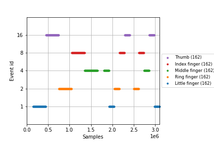

## Inspect raw data
Now that you have a sense about what is in the data files, it is time to take a look at the actual data. Always start by visually inspecting raw data.

There are several parameters which you can change in the plot functtion. First, plot all channels and show the events. Then pick only a subset of the channels. when using `pick` you have to do this on a copy of the object.

```{python}
#%% Inspect raw data
raw.plot(events=eve, event_id=event_id, show=show_plots)  # Note that all channels are plotted, change show=True to view plot

figname = join(figs_path, 'raw_data.png')
if not exists(figname):
    fig = raw.copy().pick(['mag']).plot(events=eve, event_id=event_id, start = 120)  
    fig.savefig(figname)
```

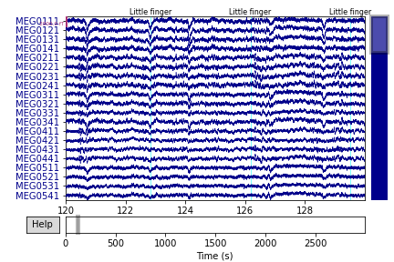

Browse through the data. Find browsing functions under the Help button.

You can also change visalization option. Try, for example, to add a low-pass filter to the data`:

```{python}
#%% Show filtered raw
raw.plot(eve, lowpass=40, show=show_plots)
```

## Create trials from raw data
Now that you have a sense about what is in the data files, it is time to cut out the events of interest.

This is an event-related study, so we want to import data around the events of interest. You do this with `mne.Epochs`. You need to specify the time around the triggers that you want to import, which trigger events, and preferably the event name of thouse triggers. You can define a lot of other parameters but we keep it simple for now. Note that the data will not be loaded in memory.

```{python}
#%% Create epochs
tmin = -2  # seconds before trigger
tmax = 2  # seconds after trigger

epochs = mne.Epochs(raw, events=eve, event_id=event_id, tmin=tmin, tmax=tmax)
```

You can have a look at the events in the epochs by calling `epochs.events`.
You can also get a summary of the epochs object by callling `epochs`

The epochs were created for all events, but if you for some reason only want epochs from one trigger you can define a new event_id dictonary.

```{python}
#%% Select only one event
only_index_id = {'Index finger': 8}
index = mne.Epochs(raw, events=eve, event_id=only_index_id, tmin=tmin, tmax=tmax)
```

Now let's work a bit with the data.
> A large dataset in your computers memory and can cause it become very slow to the point that it will crash. Therefore we decimate the epochs by a factor of 5, witch effectively reduces the sample rate to 200Hz.


```{python}
#%% Create downsampled epochs
epochs.decimate(5)
epochs.load_data() # load data
```

The epochs object contain all the data from all channels and have multiple attributes and methods which can be applied on the epochs.

Explore the different methods by typing `epochs.` followed by tab in the console to see all methods options.

> **Question 1.3:** Explain how the MEG/EEG is data stored in the `epochs` struct.

In MNE-python data from all split-files are automatically read. This is conserved in the epochs so saved epochs files are automatically read as one instance. At this point we do not split the data into MEG or EEG channels.

Lets save the `epochs` and load the data.

```{python}
#%% Save/load epochs
epo_name = join(output_path, 'tactile_stim_ds200Hz-epo.fif')
if not exists(epo_name):
    epochs.save(epo_name, overwrite=True)

else:
    epochs = mne.read_epochs(epo_name)
```


## Inspect trials
You can use plots to visually inspect data after we have segmented it into trials. This time we make a "butterflyplot" by averaging, but there are several other plot options like eg. `plot_image()`. Define `picks` in as argument if you want specific channel types, otherwise all MEG and EEG types are plotted. `spatial colors` gives you an indication of the distribution over the head.

```{python}
#%% Plot epochs
# Butterflyplots
# Plot MEG and EEG

# Without any arguments into plot(), both MEG types and EEG will be plotted. You can select by adding 'mag', 'grad' or 'eeg' to picks, eg. epochs.average().plot(picks='eeg')
figname = join(figs_path, 'butterfly.png')
if not exists(figname):
    fig, ax = plt.subplots(3, 1, figsize=(6, 10))
    epochs.average().plot(spatial_colors=True, axes=ax)
    plt.tight_layout()
    fig.savefig(figname)

# Visualize with an image plot:
# epochs.plot_image()  # image
figname = join(figs_path, 'epochs_image.png')
if not exists(figname):
    fig = epochs.plot_image(picks='mag')[0]
    fig.savefig(figname)

```
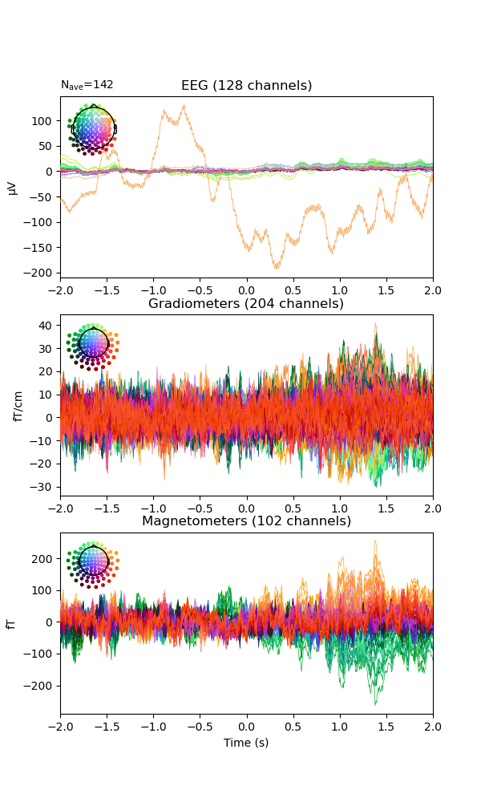
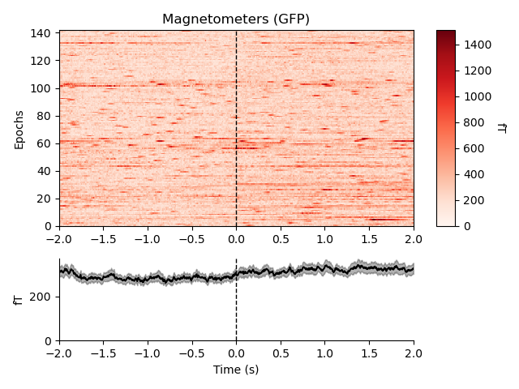

You can add visual pre-processing options using the `plot` as before.

Try inspect the data and see if you can identify some bad electrodes (and MEG sensors). If you want to note bad channels you can edit the `epochs.info['bads']` object, which is a list, so be careful not to replace previous information, instead you can use `epochs.info['bads'].extend()`.

```{python}
#%% Plot epochs (continue)
epochs.plot(show=show_plots)
# While in the plot, show inspection alternatives by pressing '?'
# eg. press 'h' to see the peak-to-peak amplitude

```

## EEG specific pre-processing
These steps are specific for EEG:
* The data for the removed channels are interpolated back in based on their neighbours
* The data is re-referenced to the average of all the channels

### Identify bad channels
The bad electrodes will mess up our analysis if left in. There are many ways to detect and deal with artifacts. You can use `epochs.plot()` and manually mark channels or epochs as bad by pressing on them. You can set a rejection thresholds based on the peak-to-peak amplitude.

```{python}
#%% Select channels and set bad channels for interpolation
eeg = epochs.copy().pick_types(eeg=True)

eeg.average().plot_image(show=show_plots)
eeg.average().plot_topo(show=show_plots)

eeg.average().plot(show=show_plots)

# Add the bad channels to the list
bad_chs = ['EEG027', 'EEG003', 'EEG008', 'EEG034', 'EEG096']
epochs.info['bads'].extend(bad_chs)
```

In general, there is no need to work with the MEG and EEG as separate objects as we can picks channels for each operation.

> **Question 1.4:** Which channels did you mark as bad and why (you can use figures to illustrate)?

### Interpolate bad channels

The bad electrodes will be interpolated with the spherical spline method.

```{python}
#%% Interpolate bad channels
epochs_ip = epochs.copy().interpolate_bads()

```

Plot the interpolated and non-interpolated EEG data. Can you spot the differences?

```{python}
#%% Compare interpolated
epochs.average().plot(picks='eeg', exclude='', show=show_plots)  # exclude='bads' default 
epochs_ip.average().plot(picks='eeg', exclude='', show=show_plots)

```

### Re-reference to common average
The reference for the EEG signals has a great impact on how the signals appear. What reference you should use depends on several factors, such as what signals you are looking at, what is conventionally done, etc..

In the tutorial data, EEG was recorded with the FCz electrode as reference. This is almost above the sensorimotor areas so not ideal for looking at sensory potentials as we will in this tutorial. Therefore we re-reference the EEG data. We will use a reference consisting of the average of all channels with `epochs_ip.set_eeg_reference(ref_channels='average')`. We could have done this step already on the raw data above, but for now let's do it on the epochs data. We apply the new average reference on the epochs with interpolated channels.

```{python}
#%% Add reference to EEG
# Plot with FCz reference
epochs_ip.copy().pick_types(eeg=True).plot(n_channels=5, scalings={'eeg':100e-6}, show=show_plots)

# Add reference
epochs_ip.set_eeg_reference(ref_channels='average')

# Plot without reference
epochs_ip.copy().pick_types(eeg=True).plot(n_channels=5, scalings={'eeg':100e-6}, show=show_plots)

```


## Remove bad trials
In this step, we remove bad trials. We will remove the same bad trials from both MEG and EEG data. This is not necessary if we were analysis MEG and EEG separately. But in this tutorial we also want to compare MEG and EEG, so we want to have the exact same trials in both datasets.

If you have several experimental conditions, always collapse all conditions before summarizing and rejecting to avoid subjective bias. You have already done this if you imported trials all five triggers [1, 2, 4, 8, 16].

Removing bad trials is not as straight forward using MNE-Python compared to FieldTrip's `ft_rejectvisual`.

Find thresholds that is suitable for your data. You might have to play around a little to find reasonable thresholds. Use `epochs_ip.plot()` then 'h' to see a histogram of the peak-to-peak amplitudes and set appropriate rejection thresholds.

```{python}
#%% Remove trials based on thresholds
reject_criteria = dict(mag=5500e-15,    # 5500 fT
                       grad=2000e-13,    # 2000 fT/cm
                       eeg=600e-6,      # 600 µV
                    #  eog=300e-6       # 300 µV
                       ) 
flat_criteria = dict(mag=1e-15,         # 1 fT
                     grad=1e-13,        # 1 fT/cm
                     eeg=1e-6)          # 1 µV

epochs_clean = epochs_ip.copy().drop_bad(reject=reject_criteria, flat=flat_criteria)

# Save the cleaned epochs
epo_name = join(output_path, 'tactile_stim_ds200Hz-clean-epo.fif')
if not exists(epo_name):
    epochs_clean.save(epo_name, overwrite=True)
else:
    epochs_clean = mne.read_epochs(epo_name)
```

An another way to inspect data and remove artifacts is to use the `autoreject` package, which is installed separate from `mne`. Read more [here](https://autoreject.github.io/stable/index.html). This is somewhat more time consuming, but less sensitive to subjective bias.


By now we have some data in memory which we don't need, so lets clean up a bit before moving on.

```{python}
#%% Clear some memory
del(eeg, index, epochs, epochs_ip, raw)
```

## Advanced pre-processing: independent component analysis (ICA)
Independent component analysis (ICA) is a decomposition method that breaks data into statistically independent components. ICA is useful for identifying patterns of activity that occur regularly in the data. ICA has many applications in MEG/EEG analysis. The most common use is to identify activity related to eye-blinks and heart-beats. These are part of the signal that we (usually) do not want.

Before running ICA it is recommended to apply a high-pass filter on the data of 1Hz. We can use the filtered data to fit the ICA, but the non-filtered data to apply the ICA on.

The code below shows how to remove eye-blinks and heart-beats from the MEG data.

```{python}
#%% ICA fit
# Since this is a very time consuming process, lets load the saved ICA-file if we have one from earlier.
ica_name = join(output_path, 'tactile_stim_ds200Hz-ica.fif')
raw_ds_name = join(output_path, 'tactile_stim_ds200Hz_hp1Hz-raw.fif')

if exists(raw_ds_name):
    raw = mne.io.read_raw_fif(raw_ds_name)
else:
    # We filter in place
    raw.resample(200) # since we need to load the raw data, lets downsample to 200Hz (same as epochs)
    raw.load_data()
    raw.save()
    raw.filter(1, None)

if exists(ica_name):
    ica = mne.preprocessing.read_ica(ica_name)
    
else:
    ica = mne.preprocessing.ICA(n_components=40,
                                method='fastica',
                                random_state=99)
    ica.fit(raw, picks='meg') # Using only the MEG channels
    # Save the ICA object
    
    ica.save(ica_name, overwrite=True)

# Explore the ICA solution
raw.load_data()
explained_var_ratio = ica.get_explained_variance_ratio(raw)
for channel_type, ratio in explained_var_ratio.items():
    print(
        f'Fraction of {channel_type} variance explained by all components: '
        f'{ratio}'
    )
```

Plot the components (if plot is interactive you can bring up component properties):

```{python}
#%% ICA plots
ica.plot_sources(raw) # right click the component name to view its properties
ica.plot_components(inst=raw) # click the components to view its properties
# or
ica.plot_properties(raw, picks=[0, 1])

```

See if you can find components that correspond to eye-blinks and heart-beats from the component topographies and component time-series? When you have found the components that correspond to eye-blinks and heart-beats, you can remove by adding them to the list `ica.exclude`:

```{python}
#%% Exclude components
ica.exclude = [0, 1]
```


<!-- 
```{python}
#%% 
ica.exclude=[]
ica_comps = mne.make_fixed_length_epochs(ica.get_sources(raw), duration=1)
ica_psd = ica_comps.compute_psd('welch', picks='all', fmax=60, window='hann', n_fft=200)
ica_psd_data = ica_psd.get_data()
ica_data = ica_comps.get_data()

fig, ax = plt.subplots()
ax.imshow(abs(ica_psd_data.mean(0)), aspect='auto')

ica_comps.plot_image('all')
```
 -->


### Semi-automatic detection of ECG components
The following code will find the components that show similarity to the ECG signal. It uses automatic detection of ECG artefacts, then makes epochs around the artefacts.


```{python}
#%% Semi-automated ECG detection
# Clear the manual list
ica.exclude = []

ecg_indices, ecg_scores = ica.find_bads_ecg(raw)
ica.exclude.extend(ecg_indices)

fig = ica.plot_scores(ecg_scores, show=show_plots)
figname = join(figs_path, 'ica_ecg_comp_score.png')
if not exists(figname):
    fig.savefig(figname)

for ecg in ecg_indices:
    fig = ica.plot_properties(raw, picks=ecg, show=show_plots)[0]
    figname = join(figs_path, f'ica_ecg_comp_propch_{ecg}.png')
    if not exists(figname):
        fig.savefig(figname)

ecg_evoked = mne.preprocessing.create_ecg_epochs(raw).average()
ecg_evoked.apply_baseline(baseline=(None, -0.2))
fig = ecg_evoked.plot_joint(picks='mag')
figname = join(figs_path, 'ecg_evoked.png')
if not exists(figname):
    fig.savefig(figname)

```

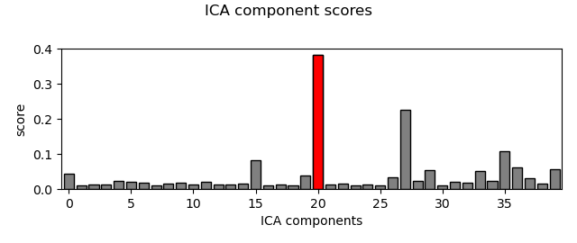

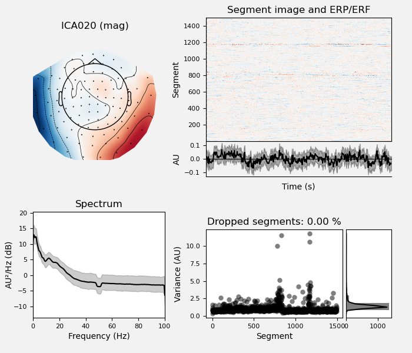

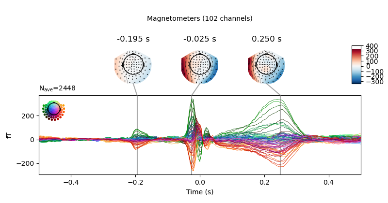

### Semi-automatic detection of EOG components
The following code will find the components that show similarity to the EOG signal to remove eye-blinks. It uses Fieldtrip's automatic detection of EOG artefacts. It is similar to the semi-automatic detection of ECG components, but for EOG, we do the procedure twice to for each EOG channel (H/VEOG).


```{python}
#%% Semi-automated EOG detection
eog_indices, eog_scores = ica.find_bads_eog(raw)
ica.exclude.extend(eog_indices)

fig = ica.plot_scores(eog_scores, show=show_plots)
figname = join(figs_path, 'ica_eog_comp_score.png')
if not exists(figname):
    fig.savefig(figname)


for eog in eog_indices:
    fig = ica.plot_properties(raw, picks=eog, show=show_plots)[0]
    figname = join(figs_path, f'ica_eog_comp_prop_ch{eog}.png')
    if not exists(figname):
        fig.savefig(figname)

eog_evoked = mne.preprocessing.create_eog_epochs(raw).average()
eog_evoked.apply_baseline(baseline=(None, -0.2))
fig = eog_evoked.plot_joint(picks='mag')
figname = join(figs_path, 'eog_evoked.png')
if not exists(figname):
    fig.savefig(figname)
```

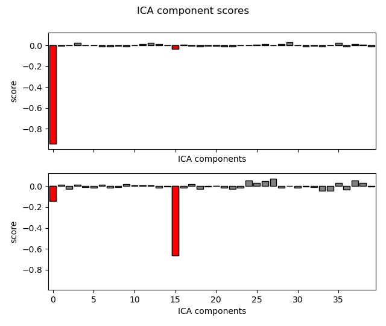

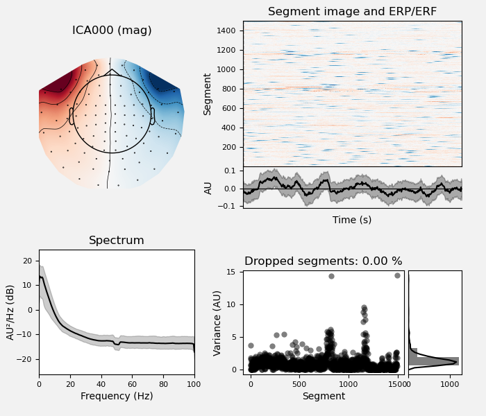

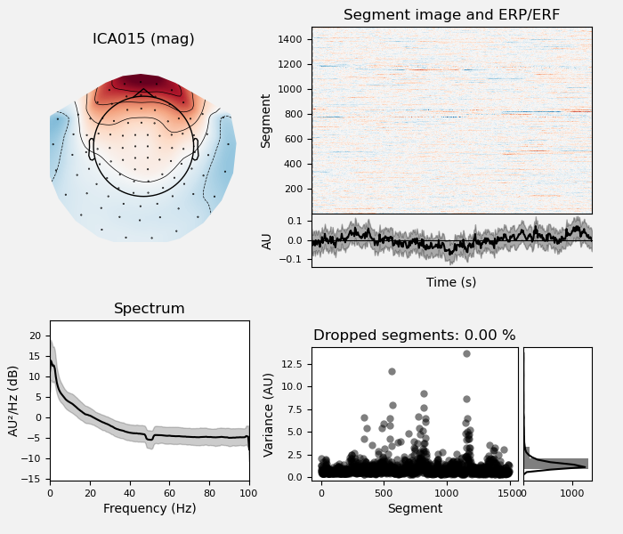

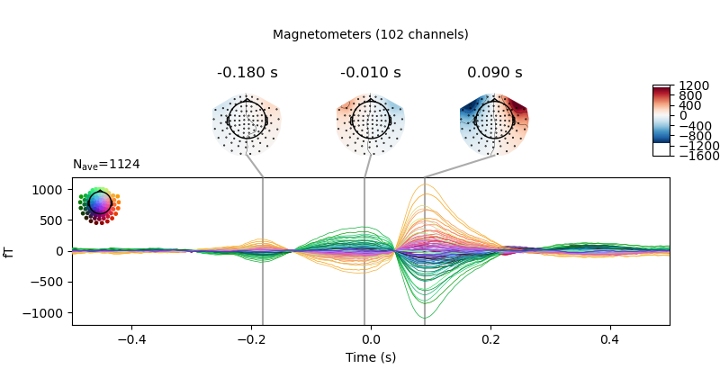


### Reject the marked components
Finally we remove the ECG and EOG componets by applying the ICA on (a copy of) the epochs:


```{python}
#%% Apply ICA
# Make sure you have added the components to the list
ica.exclude

epochs_clean_ica = epochs_clean.copy()
ica.apply(epochs_clean_ica)

```

### Save data
Finally, save the data:

```{python}
#%% Save cleaned epochs
epo_name = join(output_path, 'tactile_stim_ds200Hz-clean-ica-epo.fif')
if not exists(epo_name):
    epochs_clean_ica.save(epo_name, overwrite=True)

```

## End of Tutorial 1a...
Congratulations, you have now imported and prepared MEG and EEG. The tutorial continues in **Tutorial 1B: evoked responses**, where you will continue the processing on the data to get the evoked responses.
