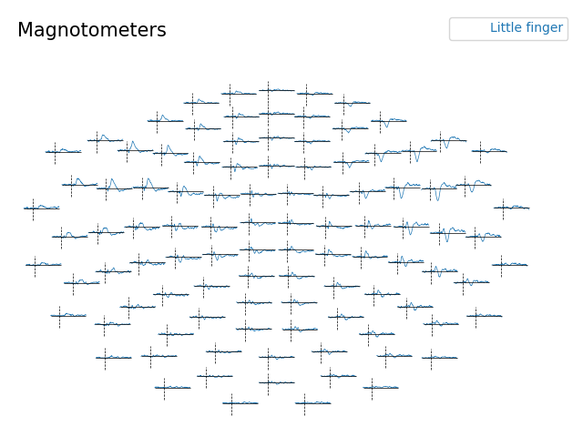
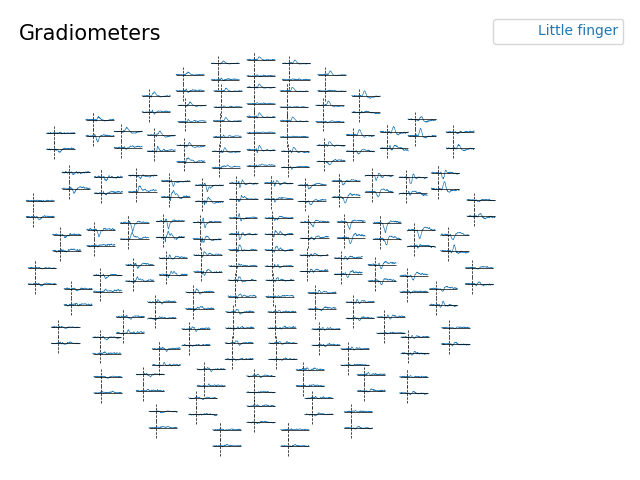
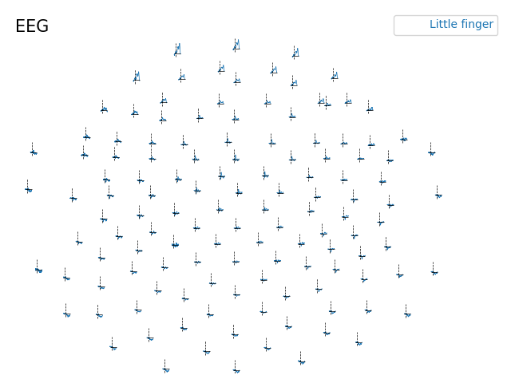
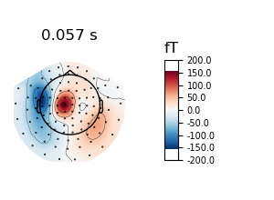
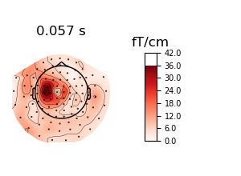
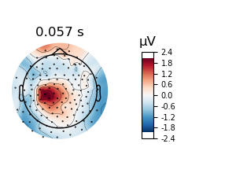
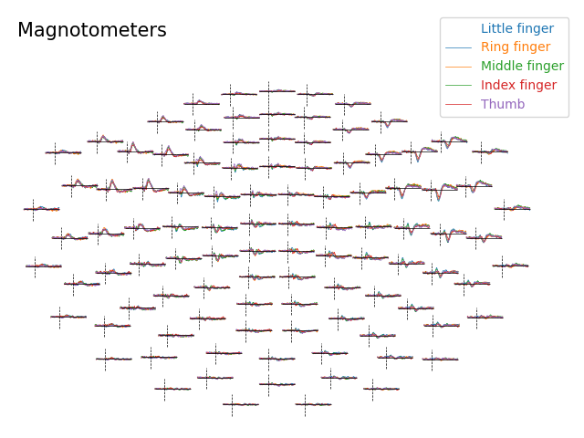
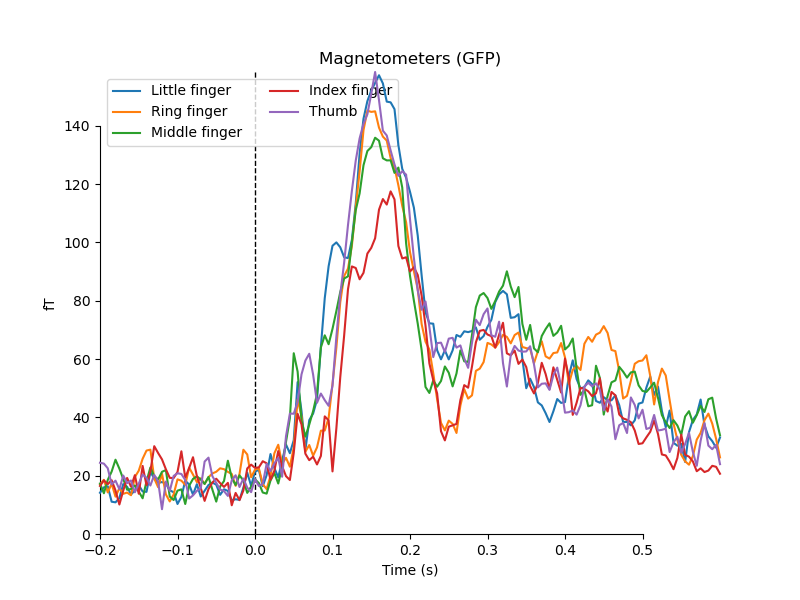

# Tutorial 1B: evoked responses

In this tutorial, you will continue the processing of MEG/EEG data from the pre-processed data to evoked responses. These steps are:

1. Baseline correct data.
2. Average trials to get evoked responses.
3. Plot and inspect the evoked responses.

## Import libraries and setup paths
The first step is to point to the path where we have the data. Change these to appropriate paths for your operating system and setup. Here I choose to use paths relative to where the scripts are.

```{python}
# %% Import modules and set up paths
import mne
import os
from os.path import join, exists, expanduser
import numpy as np
import matplotlib.pyplot as plt

# project_path = join(expanduser('~'), 'courses/meeg_course_mne') # Change to match your project path
# meg_path = join(project_path, '../data')   # Change to match your data path
# figs_path = join(project_path, 'figs')

meg_path = '../data'
figs_path = 'figures'

print(os.listdir(meg_path))
print(os.listdir(figs_path))

show_plots = False # Change to True to open plots in browser

```

Then define the subject and recording specific paths.

```{python}
# %% Define subject paths and list of all subjects/session

subjects_and_dates = [
    'NatMEG_0177/170424/'  # Add more subjects as you like, separate with comma    
    ]
           
# List of all filenames that we will import                
filenames = [
    'tactile_stim_raw_tsss_mc.fif',
    'tactile_stim_raw_tsss_mc-1.fif',
    'tactile_stim_raw_tsss_mc-2.fif'
            ]

# Define where to put output data
output_path = join(meg_path, subjects_and_dates[0], 'MEG')
```


## Load data
```{python}
# %% Load the data

epo_name = join(output_path, 'tactile_stim_ds200Hz-clean-ica-epo.fif')
epochs = mne.read_epochs(epo_name)
```

## A little more pre-processing
The data `cleaned_downsampled_data` had data 2 seconds before and after the stimulation. For this analysis, we are only interested in the activity that is "evoked" by the stimulation itself. Evoked responses are (usually) not lasting more than 500-1000 ms after stimulation before returning to baseline activity. We will, therefore, cut the epochs to only have data from stimulation (t = 0) until 600 ms after stimulation, and a 200 ms pre-stimulus baseline period. 

Since we are interested in the slow evoked responses, we might as well get rid of high-frequency noise: we will apply a 70 Hz lowpass filter before proceeding.

```{python}
hp, lp = None, 70
epochs.filter(hp, lp)
```

Crop trials into time of interest:

```{python}
tmin, tmax = -0.200, 0.600
epochs.crop(tmin=-tmin, tmax=tmax)
```


The final step before we average data is to baseline correct data by subtracting the mean of the baseline period from -200 ms to 0. 

```{python}
baseline = (None, 0)
epochs.apply_baseline(baseline)
```

## Calculate evoked responses
The final step is to average over trials with `average()`. We can do all events separate at once by changing `by_event_type` to `True`. Note that this creates a list of evoked responses.

```{python}
evo = epochs.average(by_event_type=True)
```

Congratulations, you have now computed evoked responses.

> **Question 1.5:** What is in you newly created `evo` struct? Explain the different fields.

## Visualize evoked responses

For easy referal to events and visualization it can be handy to put the evoked responses into a dictonary.
```{python}
evod = {ev.comment: ev for ev in evo}
evod['Little finger']
```

Use `mne.viz.plot_evoked_topo` to plot the ERFs/ERPs. The plots show the averaged responses for all sensors of the given type.

```{python}
#%% Topo-plots
# For magnotometers
fig = mne.viz.plot_evoked_topo(evod['Little finger'].copy().pick_types('mag'), title='Magnotometers',
                               show=show_plots)
figname = join(figs_path, 'evoked_mag_topo.png')
if not exists(figname):
    fig.savefig(figname)

# For magnotometers
fig = mne.viz.plot_evoked_topo(evod['Little finger'].copy().pick_types('grad'), title='Gradiometers',
                               show=show_plots)
figname = join(figs_path, 'evoked_grad_topo.png')
if not exists(figname):
    fig.savefig(figname)

# For EEG
fig = mne.viz.plot_evoked_topo(evod['Little finger'].copy().pick_types(eeg=True), title='EEG',
                               show=show_plots)
figname = join(figs_path, 'evoked_eeg_topo.png')
if not exists(figname):
    fig.savefig(figname)


```

The plots are interactive. Use your courser to select channels and then click on them to open a new figure that zooms in on the selected channels. You can then highlight parts of the time-series in the same way to open a new figure that shows the topography of that time window. Use this to explore the evoked responses.







> **Question 1.6:** Why is it a good idea to plot magnetometers and gradiometers separately? 

You can plot both magnetomenters and gradiomenters in a single plot with ` mne.viz.plot_evoked_topomap` by not adding  `.copy().pick_types('grad')`:

```{python}
mne.viz.plot_evoked_topo(evod['Little finger'], show=show_plots)
```

## Interpreting topographies
Because the gradiometer channels are arranged in pairs that measure the gradient of the magnetic field in orthogonal directions, each channel in a channel pair can have opposite signs (you can see this clearly in gradiometer plot you made with `mne.viz.plot_evoked_topo` above). If you explore the plots of the gradiometer data the RMS of the two gradiometer sensors for each position are used.

Now take a look at the topographies:

```{python}
#%% Topomap plots
time = 0.057  # Single time point (t = 57 ms)

fig = evod['Little finger'].plot_topomap(times=time, ch_type='mag', colorbar=True)
figname = join(figs_path, 'evoked_mag_topomap.png')
if not exists(figname):
    fig.savefig(figname)

fig = evod['Little finger'].plot_topomap(times=time, ch_type='grad', colorbar=True)
figname = join(figs_path, 'evoked_grad_topomap.png')
if not exists(figname):
    fig.savefig(figname)
fig = evod['Little finger'].plot_topomap(times=time, ch_type='eeg', colorbar=True)
figname = join(figs_path, 'evoked_eeg_topomap.png')
if not exists(figname):
    fig.savefig(figname)
```





> **Question 1.7:** Based on the topographies: where do you estimate that are equivalent current dipoles and how many? Hint: remember the right-hand rule and what the different sensor types measure.
>
> Note that the EEG topography above is misleading for locating dipoles. Something in the pre-processing did not go right. What might this be? Did you do better? 

## Evoked for all events

Now let us look at the ERFs and ERPs for the stimulation on all five fingers. We have already created the evoked responses, in a dict `evod` and in a list `evo`

We can also compute the noise covariance estimation, which is necessary if you want to combine magnetometers, gradiometers and electrodes when doing source analysis.

```{python}
# %% Create the noise covariance
noise_cov = mne.compute_covariance(epochs)

# Save the noise covariance matrix
cov_name = join(output_path, 'tactile_stim_ds200Hz-clean-ica-cov.fif')
mne.write_cov(cov_name, noise_cov, overwrite=True)
```

Save the data for later:

```{python}
#%% Save the epochs
evo_name = join(output_path, 'tactile_stim_ds200Hz-clean-ica-ave.fif')
mne.write_evokeds(evo_name, evo, overwrite=True)

```

## Plot all evoked responses in one figure
You can use `mne.viz.plot_evoked_topo` to plot all conditions in the same figure for easy comparison:

```{python}
# %% For the topo-plot add the list of evoked
fig = mne.viz.plot_evoked_topo([ev.copy().pick('mag') for ev in evo], title='Magnotometers')
figname = join(figs_path, 'evoked_mag_all_topo.png')
if not exists(figname):
    fig.savefig(figname)
```



```{python}
# %% For the ERF/P plot add the dict or list of evoked
fig = mne.viz.plot_compare_evokeds(evod, picks='mag')[0]
figname = join(figs_path, 'evoked_mag_all_erf.png')
if not exists(figname):
    fig.savefig(figname)
```




## End of Tutorial 1b