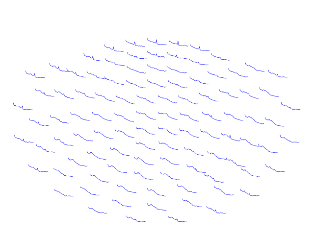

# Frequency analysis
In this tutorial, you will look at different methods for analysis frequency-specific responses in MEG/EEG data.

## Import libraries and setup paths
The first step is to point to the path where we have the data. Change these to appropriate paths for your operating system and setup. Here I choose to use paths relative to where the scripts are.


## Developer comments

- A peak at 22Hz when applying Hanning window.
- method 'multitaper' does not allow defining padding
- 


```{python}
#%% Import modules and set up paths
import mne
import os
from os.path import join, exists, expanduser
import numpy as np
import matplotlib.pyplot as plt
import matplotlib.colors as mcol

# project_path = join(expanduser('~'), 'courses/meeg_course_mne') # Change to match your project path
# meg_path = join(project_path, '../data')   # Change to match your data path
# figs_path = join(project_path, 'figs')

meg_path = '../data'
figs_path = 'figures'

show_plots = False # Change to True to open plots in browser

```

Then define the subject and recording specific paths.

```{python}
#%% Define subject paths and list of all subjects/session

subjects_and_dates = [
    'NatMEG_0177/170424/'  # Add more subjects as you like, separate with comma    
    ]
           
# List of all filenames that we will import                
filenames = [
    'tactile_stim_raw_tsss_mc.fif',
    'tactile_stim_raw_tsss_mc-1.fif',
    'tactile_stim_raw_tsss_mc-2.fif'
            ]

# Define where to put output data
output_path = join(meg_path, subjects_and_dates[0], 'MEG')
```

## Load data
Read in cleaned epochs from **Tutorial 1A** (remember where you put the data and what you named it).
If you did not complete the data preperation tutorial, you can load the data file `tactile_stim_ds200Hz-clean-ica-epo.fif` from the tutorial material:

## Load data
```{python}
#%% Load the data
epo_name = join(output_path, 'tactile_stim_ds200Hz-clean-ica-epo.fif')
epochs = mne.read_epochs(epo_name)
```

> **Question 2.1:** previosuly we downsampled data to 200Hz. As a consequence hereof, what is the highest frequency we can investigate in this data?

## Select data
The In the following tutorial, we will only analyse the conditions where the thumb was stimulated. Lets create a separate instance with only the thumb.

```{python}
#%% Select thumb events
thumb = epochs['Thumb'].apply_baseline((None, 0))
```

## Estimate power spectral density
We are going to compute the power spectral density (PSD). This gives us the average power across all trials. 

We will use different methods to estimate PSD: 
1) a single taper window
2) multi-tapered windows. 

PSD calculations is done with the MNE-Python function `compute_psd()`. Otherwise, use the `mne.time_frequency` class for running other types of frequency analysis such as doing the time-frequency analysis. 

###  PSD with single taper
In the first calculation, we will use a Hann window to taper the epochs. This is applied to each epoch in the data structure before doing Fourier decomposition and then calculating the power. Lets us define the windowing/tapering function. 

```{python}
method = 'multitaper'
bandwidth = 'hann'
fmin = 1
fmax = 95

psd_hann = thumb.compute_psd(method=method, fmin=fmin, fmax=fmax, bandwidth=bandwidth)
```

Once finished, look at what is in the structure `psd_hann.get_data()` (hint: use `.shape`).

> **Question 2.2:** What is the dimension of the data, and what do the dimensions represent?

Plot the PSD using `plot_topo()`. Since we want to see the averaged data we also need to apply `average()`. Finally, to reduce the span, redo the computation with 45 as fmax. Note that the plot is interactive.

```{python}
method = 'multitaper'
bandwidth = 'hann'
fmin = 1
fmax = 45

psd_hann = thumb.compute_psd(method=method, fmin=fmin, fmax=fmax, bandwidth=bandwidth)

fig = psd_hann.average().plot_topo(color='black', fig_facecolor='white', axis_facecolor='white',
                                    show=show_plots)

figname = join(figs_path, 'PSD_hann.png')
if not exists(figname):
    fig.savefig(figname)
```



### PSD with multitapers
Now we will do the same analysis, but use tapers based on Slepian sequences of tapers. The spectral smoothing is specified by defining the bandwidth. Again `compute_psd()` will then calculate the number of tapers needed to achieve the desired frequency smoothing. Note that the frequency smoothing is the range in either direction, so the frequency smoothing is the double of the numerical value given in `bandwidth`.

> **Question 2.3:** How many tapers is used when you run the command below? Hint: it tells you in the terminal.

```{python}
method = 'multitaper'
bandwidth = 4
fmin = 1
fmax = 95

psd_multi = thumb.compute_psd(method=method, fmin=fmin, fmax=fmax, bandwidth=bandwidth)
```

Plot the PSD using `.plot_topo()` as above.

Try to change the frequency smoothing range to e.g 20 Hz.

```{python}
method = 'multitaper'
bandwidth = 20
fmin = 1
fmax = 95

psd_multi10 = thumb.compute_psd(method=method, fmin=fmin, fmax=fmax, bandwidth=bandwidth)
```

Compare the single taper PSD, and the two multitaper PSD you have calculated. Plot them side-by-side using `matplotlib.pyplot` imported as `plt`

```{python}
fmin, fmax = 1, 45
fig, ax = plt.subplots()
for p, lab in zip([psd_hann, psd_multi, psd_multi10], ['Hann', 'Multi 2', 'Multi 10']):
    psd, freqs = p.get_data(picks = ['mag'], fmin=fmin, fmax=fmax, return_freqs=True)
    ax.plot(freqs, np.log10(psd.mean(0).mean(0)), label = lab)
ax.legend()
fig
figname = join(figs_path, 'PSD_all.png')
if not exists(figname):
    fig.savefig(figname)
```


Compare the results from the different methods to calculate PSD.

> **Question 2.4:** Select the alpha range (~8-12 Hz) by changing `fmin` and `fmax`. How different/alike are they? Explain why?
>
> Select the beta range (~14-30 Hz) and compare topo-plots. How different/alike are they? Explain why?
>
> Finally, plot the "high-gamma" range (~55-95 Hz). How do the high-gamma spectra compare between methods?


```{python}
fig, ax = plt.subplots(3, 1)
i = 0
for b, bn in zip([(8, 12), (14, 30), (55, 95)], ['Alpha', 'Beta', 'High gamma']):
    for p, lab in zip([psd_hann, psd_multi, psd_multi10], ['Hann', 'Multi 2', 'Multi 10']):
        psd, freqs = p.get_data(picks = ['mag'], fmin=b[0], fmax=b[1], return_freqs=True)
        ax[i].plot(freqs, np.log10(psd.mean(0).mean(0)), label = lab)
        ax[i].set_title(bn)
        ax[i].legend()
    i += 1
fig
```

Bonus: View the PSD of EEG

```{python}
fmin, fmax = 1, 45
fig, ax = plt.subplots()
for p, lab in zip([psd_hann, psd_multi, psd_multi10], ['Multi 1', 'Multi 2', 'Multi 10']):
    psd, freqs = p.get_data(picks = ['eeg'], fmin=fmin, fmax=fmax, return_freqs=True)
    ax.plot(freqs, np.log10(psd.mean(0).mean(0)), label = lab)
ax.legend()
fig.suptitle('EEG')
fig
```

## Time-frequency analysis
The PSD analysis above assumes that the spectral power is the same across the entire epoch. But we can also analyze how the spectral signals evolve, e.g. how oscillatory activity changes as a response to stimuli.

Instead of calculating the power across the entire epoch and then average all epochs, we now will calculate the power for each time sample. In essence, we centre the window on a given time sample and estimate the power of that particular window. We can use different arguments to balance the resolution between time and frequency. 

### Get TFR with single taper MEG
In FieldTrip, you also use the function `mne.time_frequency.tfr_multitaper` to calculate the time-frequency response (TFR) using tapers. We can adjust the frequency resolution by defining the `freqs` of interest and the number many cycles per wavelet.

NB. TFR calculations take significantly longer time to calculate than PSD. You can always pick a selection by adding e.g `picks='mag'` to only select magnotometers and save time. You can always go back and redo the other channel types. This creates an AverageTRF-object. To create an EpochTFR-object you need to have `average` set to `False` and to reduce memory consumption, you may need to decimate the data (eg. `decim=3`).


```{python}

freqs = np.arange(1, 45)  # Frequencies we want to estimate from 1 Hz to 45 Hz in steps of 1HZ
n_cycles=freqs/2
time_bandwidth=2

tfr_hann = mne.time_frequency.tfr_multitaper(thumb, freqs=freqs, n_cycles=n_cycles,
                                             time_bandwidth=time_bandwidth, return_itc=False)

```

```{python}
fig = tfr_hann.average().plot_topo(picks='mag', mode='logratio', cmap='jet')

figname = join(figs_path, 'TFR_noBaseline.png')
if not exists(figname):
    fig.savefig(figname)
```

> **Question 2.5:** This plot look weird! How come? What do we see in the plot (Hint: Remember the PSD plots from before)?


Do the same plot, but this time define a baseline to use as a reference for plotting. This can be from the start of the trial to stimuli at time 0 `(None, 0)`, or the entire epoch `(None, None)`. Here we use the logratio of the signal relative to baseline.

```{python}
fig = tfr_hann.plot_topo(picks='mag', baseline=(None, 0), mode='logratio', cmap='jet')
figname = join(figs_path, 'TFR_HannBaseline.png')
if not exists(figname):
    fig.savefig(figname)
```


Zoom in on a single channel:

```{python}
fig = tfr_hann.plot(picks=['MEG0711'], baseline=(None, 0), mode='logratio', cmap='jet')
figname = join(figs_path, 'TFR_hannSingleChan.png')
if not exists(figname):
    fig[0].savefig(figname)
```


> **Question 2.6:** How does the baseline change what we can infer from the TFR (Hint: Toggle the colorbar option to show what the colours represent in either plot)?

### Get TFR with Hann taper with varying length
The previous TFR analysis used a fixed window for all frequencies. This is not optimal in this case. Now we will run the same analysis, but with time windows that vary with the individual frequency. By setting `n_cycles` to single value, the window decreases with higher frequencies.

Here we use 4 cycles and a time bandwidth of 2.

```{python}
freqs = np.arange(1, 45)  # Frequencies we want to estimate from 1 Hz to 45 Hz in steps of 1HZ
n_cycles=4
time_bandwidth=2

tfr_hann = mne.time_frequency.tfr_multitaper(thumb, freqs=freqs, n_cycles=n_cycles,
                                             time_bandwidth=time_bandwidth, return_itc=False)

```

Plot the results as before (remember the baseline):
```{python}
fig = tfr_hann.plot_topo(picks='mag', baseline=(None, 0), mode='logratio', cmap='jet')

figname = join(figs_path, 'TFR_hann4.png')
if not exists(figname):
    fig.savefig(figname)
```


Zoom in on a single channel:
```{python}
fig = tfr_hann.plot(picks='MEG0711', baseline=(None, 0), mode='logratio', cmap='jet')

figname = join(figs_path, 'TFR_hann4singChan.png')
if not exists(figname):
    fig.savefig(figname)
```


> **Question 2.7:** Why the round edges in the plot?

### TFR with multitaper
Now we will do the same with a higher `time_bandwidth`.

Based on the values, how do you expect the plot of the results to look?

```{python}
freqs = np.arange(1, 45)  # Frequencies we want to estimate from 1 Hz to 45 Hz in steps of 1HZ
n_cycles=4
time_bandwidth=5

tfr_dpss = mne.time_frequency.tfr_multitaper(thumb, freqs=freqs, n_cycles=n_cycles,
                                             time_bandwidth=time_bandwidth, return_itc=False)

```

Plot the results as before with `ft_multiplotTFR`. Remember the baseline.

```{python}

fig = tfr_dpss.plot_topo(picks='mag', baseline=(None, 0), mode='logratio', cmap='jet')

figname = join(figs_path, 'TFR_tb5.png')
if not exists(figname):
    fig.savefig(figname)
```

Zoom in on single channels. Does the plot compare to your expectation?


### TFR with Morlet wavelets
Wavelets are different from the previous, in that the "tapering" is done on a wave-function that is fitted to the signal centred on the timepoints of interest.

For wavelets, we also need to specify the width of the wavelet functions, i.e., the number of cycles in each function. Let's try with 3, and keep them equal across frequencies.

```{python}
freqs = np.arange(1, 45)  # Frequencies we want to estimate from 1 Hz to 45 Hz in steps of 1HZ
n_cycles=freqs/3

tfr_morlet = mne.time_frequency.tfr_morlet(thumb, freqs=freqs, n_cycles=n_cycles, 
                                          return_itc=False, average=True)
```

Plot the results with `ft_multiplotTFR` as before.

```{python}
fig = tfr_morlet.plot_topo(picks='mag', baseline=(None, 0), mode='logratio', cmap='jet')

figname = join(figs_path, 'TFR_morlet3.png')
if not exists(figname):
    fig.savefig(figname)
```


Also try to plot the EEG TFRs for comparison:
```{python}
# Not working
fig = tfr_morlet.plot_topo(picks='eeg', baseline=(None, 0), cmap='jet')

figname = join(figs_path, 'TFR_morlet3_eeg.png')
if not exists(figname):
    fig.savefig(figname)
```

## Increase sensitivity to non-phase locked signals

One of the purposes of TFR analysis is to reveal signals that are _non-phase locked_ to stimuli in contrast to the analysis of evoked fields/potentials. But the phase-locked signals also show up in the TFRs, as they are present in the signal and therefore decomposed by the Fourier transform. To enhance the sensitivity to the non-phase locked activity, we can subtract the phase-locked activity and redo the analysis.

Before you proceed, guess how we can find the phase-locked part of the signal (Hint: you have already have done that)

The phase-locked activity is the evoked field/potential. Assuming the average evoked signal are a good representation of the phase-locked signal (i.e., sufficient signal-to-noise ratio), we can subtract it from each trial and redo the TFR analysis.


```{python}

thumb_induced = thumb.copy().subtract_evoked()

```

Now calculate TFR with wavelets as before:

```{python}
freqs = np.arange(1, 45)  # Frequencies we want to estimate from 1 Hz to 45 Hz in steps of 1HZ
n_cycles=freqs/3

tfr_morlet_induced = mne.time_frequency.tfr_morlet(thumb_induced, freqs=freqs, n_cycles=n_cycles, 
                                          return_itc=False, average=True)
```


Plot the new TFR. Can you spot the difference from the previous wavelet analysis?

```{python}
fig = tfr_morlet_induced.plot_topo(picks='mag', baseline=(None, 0), mode='logratio', cmap='jet')

figname = join(figs_path, 'TFR_morlet3_eeg_induced.png')
if not exists(figname):
    fig.savefig(figname)
```

## End of Tutoiral 2
Now you have compared different methods to calculate PSD and TFR.

> **Question 2.8:** what do the TFR results show? Pick the method you prefer and explain what type of *induced responses* we see (Hint: Remember what ERS and ERD stood for). Use representative plots to illustrate the results.
