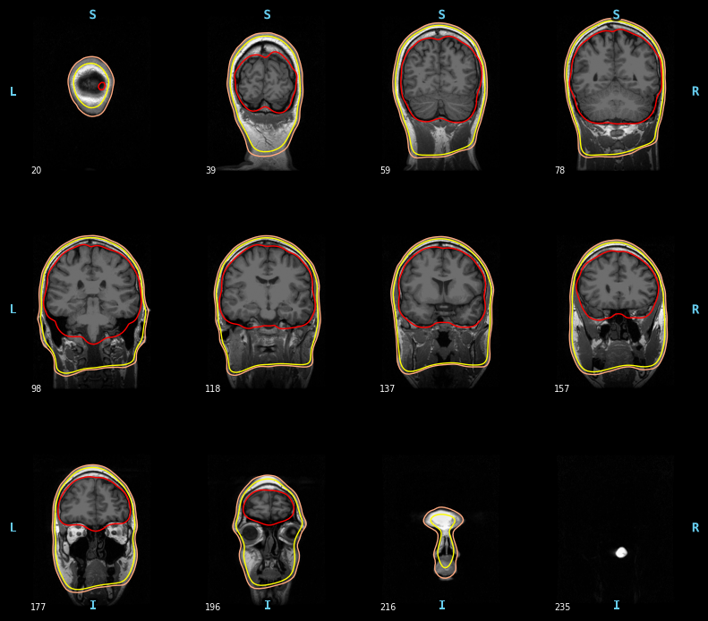
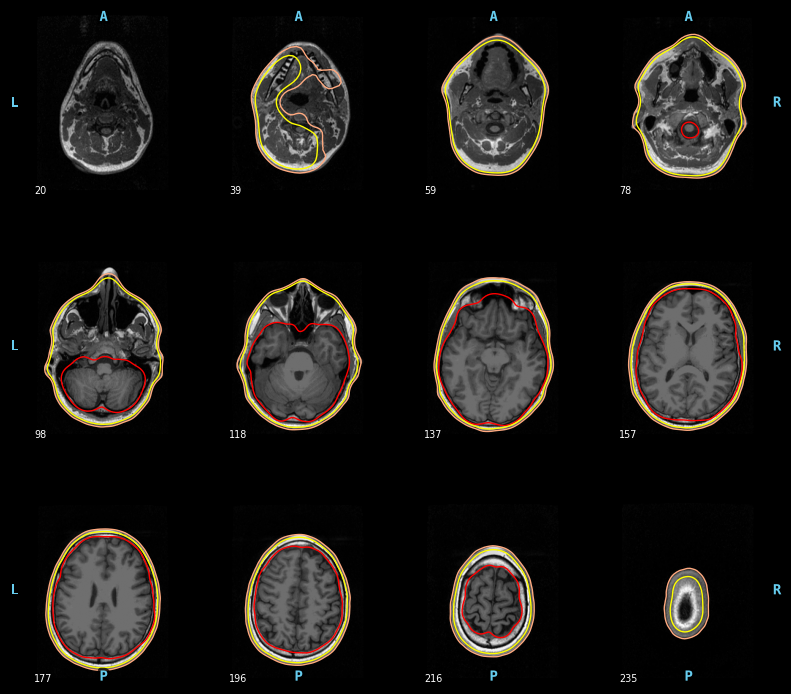
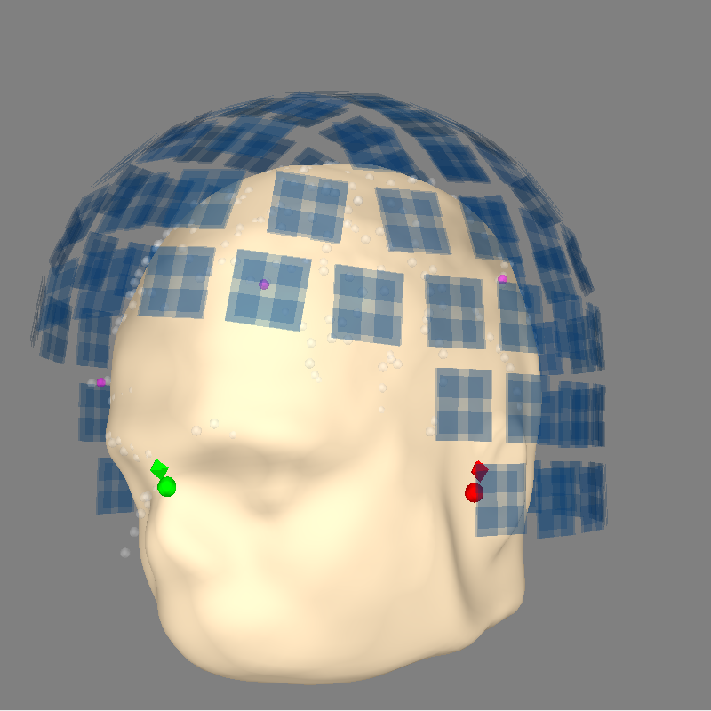
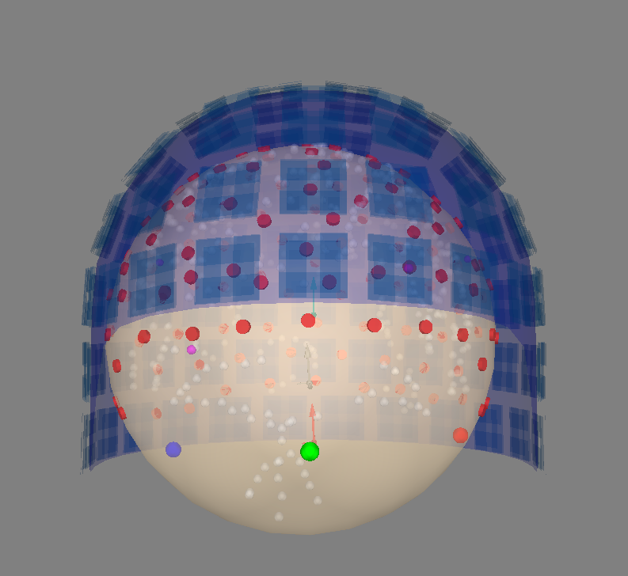

# Dev notes
- Add the .mgz mri to the data downloaded at the beginning of the class. 
- tell students if they want to use MNE-Python, they have to download freesurfer unfortunately

# Preprocess MRI data for MEG/EEG source reconstruction

To do source reconstruction of MEG and EEG signals, we need to solve the inverse problem; i.e., find the sources that generate the magnetic or electric field patterns that we measure. This inverse problem has infinite solutions. To be able to estimate the sources of the magnetic and electrical signals, we need constraints on the possible solutions. Lucky enough, we know that the origin of MEG and EEG signals is not any random electric currents, but currents in the brain; more precise the pyramidal cells in neocortex. We can use this information to constrain the solutions to the inverse problem to a set of pre-specified locations. We assume that the activity we measure comes from the brain and thus limit our possible sources to be within the brain.

We do this by constraining the inverse solution based on the anatomy of the brain and head, information about the volume containing the electric fields (the volume conduction model), and information about the location of the head relative to the MEG/EEG sensors.

To do source reconstruction of MEG and EEG signals, we need a model of the head and how it conducts electrical currents. We obtain a model of the head and the brain from a structural magnetic resonance image (MRI). The three necessary ingredients in MEG and EEG source reconstruction is:

1. MEG/EEG data.
2. A structural MRI.
3. Information about the relative location of sensors to the head.

Usually, we want individual MRI for each participant to accommodate individual differences in head geometry and shape of the brain. Still, in some cases, it can be sufficient to use a template brain.

In this tutorial, we have an MRI for the subject. We have converted it to the .mgz format for use with Freesurfer. MNE-Python cannot process MRIs in the DICOM format. If you have an MRI in that format, you can change it to the NIfTI format using the toolbox 'dcm2niix' that can be retrieved from Github or installed with brew, conda, or pip in the terminal. For more information, view the Github page: https://github.com/rordenlab/dcm2niix?tab=readme-ov-file

 The MEG/EEG data is in the raw .fif files. The information about the relative location of sensors to the head is also contained in the raw ``fif`` file. This is the head point we "drew" on the subjects head together with the locations of the EEG electrodes and information about the MEG sensors location relative to the HPI coils that we measured inside the MEG.

In this tutorial, you will create a volume conductor model of the subjects head (one for MEG and one for EEG), and make sure it is aligned with the position.

## Import libraries and setup paths
The first step is to point to the path where we have the data. Change these to appropriate paths for your operating system and setup. Here I choose to use paths relative to where the scripts are.

```{python}
# Import Modules and setting up paths
import mne
import mne.bem
import os
import shutil
from os.path import join, exists
import numpy as np
import matplotlib.pyplot as plt
import numpy as np

# set paths

project_path = join(expanduser('~'), 'courses/meeg_course_mne') # Change to match your project path
meg_path = join(project_path, 'TutorialDataset') 
figs_path = join(project_path, 'figs')

show_plots = True # Change to True to open plots in browser

#%% Define subject paths and list of all subjects/session

subjects_and_dates = [
    'NatMEG_0177/170424/'  # Add more subjects as you like, separate with comma    
    ]

# Define where to put output data
output_path = join(meg_path, subjects_and_dates[0], 'MEG')
mri_path = join(meg_path, subjects_and_dates[0], 'MRI')
```

## Load the data that has the localization information 
For this requirement for the source reconstruction, I chose to use an epochs object we created, but MNE-Python also accepted Raw and Evoked objects.

```{python}
epo_name = join(output_path, 'tactile_stim_ds200Hz-clean-ica-epo.fif')
epochs = mne.read_epochs(epo_name)
```
## Making head surfaces 
### Set up your environment to access the Freesurfer functions necessary. 
MNE-Python head model creation is closely linked to Freesurfer. There is not a good way to create a headmodel in MNE without Freesurfer access. 

```{python}
fs_home = "/Applications/freesurfer" # change to your own freesurfer location
os.environ["FREESURFER_HOME"] = fs_home
os.environ["SUBJECTS_DIR"] = join(meg_path, subjects_and_dates[0], 'freesurfer_subjects')
subjects_dir = os.environ["SUBJECTS_DIR"]

# Add FreeSurfer binaries to PATH
os.environ["PATH"] = f"{fs_home}/bin:" + os.environ["PATH"]

# Ensure access to necessary functions 
print("FREESURFER_HOME =", os.environ["FREESURFER_HOME"])
print("mri_watershed found at:", shutil.which("mri_watershed")) # key binary needed for our MRI processing in MNE
```

The file structure here might seem weird or complex, but Freesurfer relies heavily on each subject having the same file structure and naming conventions. Deviating too far from the standard naming and structure conventions can cause it to be unable to find files and utilities it needs.

### Prepare segmentation layers from MRI
Here we specify which 'subject' we're working with (in our case 170424) and create a BEM segementation from our MRI. 

```{python}
subject = "170424"
mne.bem.make_watershed_bem(
    subject=subject,
    subjects_dir=subjects_dir,
    overwrite=True,
    show=True
)
plt.show()
```


The most important thing to look for is if there are sections of overlap between each layer.

We can also inspect another slicing direction to check the quality of our BEM segmentation. Orientation options include 'axial', 'sagittal', and 'coronal'.

```{python}
mne.viz.plot_bem(
    subject=subject,
    subjects_dir=subjects_dir,
    orientation="axial"
)
```


## Coregistration with MRI and M/EEG 
Now that we have our head surfaces created from the MRI, we can align our MRI and head points from the MEG/EEG data. 

Differently from Fieldtrip in Matlab, MNE-Python uses a GUI that combines many of the commands typically used to align the head points and MRI. Within the interface, the process follows these steps:

1. Ensure the MRI has been loaded with the correct subject number. 
2. Set the fiducials based on the MRI anatomy by clicking the point on the MRI you choose. You can select which fiducial you want to assign by switching between LPA, Nasion, and RPA in the GUI menu. Once you're satisfied, lock the fiducials. If you save them, they will update in the bem folder in the freesurfer subject directory.
3. See that the 'Info source with digitization' box has the file name of your epochs or other .fif file. 'Grow hair' increases the size of the scalp surface. 'Omit points' removes any points or sensors that are x mm away from the scalp surface. It is useful if there was an accidental input during digitization. 
4. Use the 'Fit ICP' button to algorithmically fit the digitized head points to the scalp. Once completed, you can adjust the fit manually if you aren't satisfied. 
5. Save the HEAD <> MRI Transform. End the filename with '-trans.fif' for future use. 

For more information on using the coregistration GUI, check out the introduction video in the MNE documentation. 

[](https://youtu.be/ALV5qqMHLlQ)

### View the coregistration 
Now that we have our transform file, we can take a look at how everything lines up. Does it look reasonable within the MEG helmet? 

```{python}
trans_file = join(output_path, "tactile_stim_ds200Hz-clean-ica-epo-trans.fif") 
trans = mne.read_trans(trans_file)

fig = mne.viz.plot_alignment(
    epochs.info,
    trans=trans,
    subject="170424",
    subjects_dir=subjects_dir,
    surfaces="head",
    show_axes=True,
    dig=True,
    eeg=[],
    meg="sensors",
    coord_frame="meg",
    mri_fiducials="estimated",
)
mne.viz.set_3d_view(fig, 45, 90, distance=0.6, focalpoint=(0.0, 0.0, 0.0))
```


## Make Head Models
If there aren't any issues with how everything aligned, we can continue to the actual creation of the head models.

We will make two different head models, one for MEG and one for EEG. MNE-Python allows you to specify the conductivity of each layer which defines how many layers it will include. 

For MEG, we only need one layer. Here we create the model and then save the solution for later use in source reconstruction.

```{python}
meg_model = mne.make_bem_model(subject='170424',
                                   conductivity= [0.3], # One layer is enough for MEG
                                   subjects_dir=subjects_dir
                                   )

meg_bem = mne.make_bem_solution(meg_model)
mne.write_bem_solution(join(output_path, '170424-meg-bem-sol.fif'), meg_bem) #remember to indicate that it's the solution for MEG only
```

For EEG, we need something more complicated. However, it's still the same code! Just with more conductivity values in the function call.

```{python}
eeg_model = mne.make_bem_model(subject='170424',
                                   conductivity=[0.3, 0.006, 0.3], #defaults in MNE for EEG head models
                                   subjects_dir=subjects_dir
                                   )
eeg_bem = mne.make_bem_solution(eeg_model)
mne.write_bem_solution(eeg_bem, join(output_path, '170424-eeg-bem-sol.fif'), eeg_bem) #remember to indicate that it's the solution for EEG only
```

An alternative to making a head model from an MRI is to make a spherical model. In MNE-Python, you can make the sphere model a similar size to the participant head using `auto` for the values of `r0` and `head_radius`. All you need to do this is an `info` object like `epochs.info` that the function can use to find a rough head shape.

```{python}
sphere = mne.make_sphere_model(info=epochs.info, r0 = 'auto', head_radius= 'auto') 
```

Now visualize this spherical head model. 

```{python}
mne.viz.plot_alignment(
    epochs.info, 
    trans=trans,
    eeg='projected',
    bem=sphere,
    dig=True,
    surfaces="outer_skin",
    coord_frame='meg',
    show_axes=True
)
```



