# Tutorial 4a: Dipole fitting
In this tutorial, you will do a dipole fit to evoked responses. For the dipole fits, we assume that the dipolar patters can be adequately explained by a few dipolar sources in the brain. We do not need to model activity in the entire brain with this method. What we will do is to create a source model of evenly distributed sources across the entire brain and then scan the sources for the best explanation of the observed scalp potentials and magnetic fields. The steps are, generally, as follows:

1. Create source space and leadfield (if necessary)
2. Do dipole fits
3. Evaluate outcome

To do this, you need to have completed three preceding steps:

Calculate time-locked data for the MEG and EEG data (tutorial 1B).
Create the head model for the MEG data (tutorial 3).
Create the head model(s) for the EEG data (tutorial 3).

## Set up paths
Change these to appropriate paths for your operating system and setup
```{python}
# Import Modules and setting up paths
import mne
import mne.bem
import os
from os.path import join, exists
import numpy as np
import matplotlib.pyplot as plt
import numpy as np

# define paths

project_path = "/Users/erin.noelle.mahan/Library/CloudStorage/OneDrive-KarolinskaInstitutet/Documents/MEG_Course_MNE"
meg_path = join(project_path, 'TutorialDataset') 
figs_path = join(project_path, 'figs')

show_plots = True # Change to True to open plots in browser

#%% Define subject paths and list of all subjects/session

subjects_and_dates = [
    'NatMEG_0177/170424/'  # Add more subjects as you like, separate with comma    
    ]
           
# Define where to put output data
output_path = join(meg_path, subjects_and_dates[0], 'MEG')
mri_path = join(meg_path, subjects_and_dates[0], 'MRI')
subjects_dir_path = join(meg_path, subjects_and_dates[0], 'freesurfer_subjects')
subject= '170424'
```
## Load relevant files
Load the required data files for dipole fits:
```{python}
#load relevant files
#evokeds
evo_path = join(output_path, 'tactile_stim_ds200Hz-clean-ica-ave.fif')
evo = mne.read_evokeds(evo_path)
# when you import evoked objects without specifying which event type you want, it imports them all as a list

epo_path= join(output_path, 'tactile_stim_hp1Hz_lp95Hz_ds200Hz-clean-ica-epo.fif')
epo = mne.read_epochs(epo_path)

#head models
eeg_bem_path = join(output_path, '170424-eeg-bem-sol.fif')
eeg_head_model = mne.read_bem_solution(eeg_bem_path)

meg_bem_path= join(output_path, '170424-meg-bem-sol.fif')
meg_head_model = mne.read_bem_solution(meg_bem_path)

# transform file
trans_file = join(output_path, "tactile_stim_ds200Hz-clean-ica-epo-trans.fif") 
trans = mne.read_trans(trans_file)
```
## Identify ERP/ERF components of interest
Before doing the dipole fits, take a look at the sensor-level ERF/ERPs to look for dipolar patters in the scalp. Try to do a "manual" source localisation using the right-hand rule.

You can plot the evoked all together...

```{python}
mne.viz.plot_evoked(evo[3], picks='mag', spatial_colors=True)
mne.viz.plot_evoked(evo[3], picks='grad', spatial_colors=True)
```


or separate them out by channel.

```{python}
mne.viz.plot_evoked_topo(evo[3], merge_grads=True)
```


Once you've found a time period that looks interesting, you can plot the topomap for the time periods of interest. 

Let's take a look at the peaks around 55 ms and 135 ms.

```{python}
mne.viz.plot_evoked_topomap(evo[3], times= (0.055), average=.005, ch_type='mag')
mne.viz.plot_evoked_topomap(evo[3], times= 0.055, average=.005, ch_type='grad' )

mne.viz.plot_evoked_topomap(evo[3], times= 0.135, average=.005, ch_type='mag')
mne.viz.plot_evoked_topomap(evo[3], times= 0.135, average=.005, ch_type='grad')
```
Topographical plot of the 55 ms ERF component for magnetometers and combined gradiometers:


Topographical plot of the 135 ms ERF component for magnetometers and combined gradiometers:


Notice how you on the topographies can make a qualified guess about the number of equivalent current dipoles and their approximate location.

## Calculate noise covariance
When doing source reconstruction in MNE-Python, you will need to provide a template of what 'no signal of interest' looks like for some of the algorithms employed in the analysis. We call this a noise covariance matrix. In MNE there are a few options of what kind of noise covariance matrix you want to make. 

One option is data driven. You will select a time period within your data that does not contain relevant signal, such as a pre-stimulus baseline period. You can use the function `compute_covariance` for this. If you know where the signal is relative to the noise, this can be a good option. If your data has been MaxFiltered, you must either calculate the `rank` parameter separately, or set `rank='info'` in your function call. This is because in the process of MaxFiltering, the rank is reduced due to the noise and artifact reduction.

> Rank is essentially the number of independent signals in your data. It can be reduced from the total number of sensors by things like MaxFilter, average referencing, bad channel interpolation, and other preprocessing steps.

Another option is called an ad hoc covariance. In this noise covariance estimation, MNE assumes a certain level of noise across all channels equally. It is not driven by the actual data. 

In this tutorial, we will use an ad hoc covariance matrix, but in future tutorials, we will try computing our own. Since we'll only be looking at magnetometers in this tutorial, we can select the channels in `epo` that contain what we want.

```{python}
mag_epo = epo.copy().pick('mag')

ad_hoc_cov = mne.make_ad_hoc_cov(mag_epo.info)
```

## Fit a single dipole
We fit single dipoles separately for the three kinds of sensors (magnetometers, gradiometers and electrodes). We do it for two latencies identified in the (sensor-level) evoked responses above:

1. Early sensory response at 45-65 msec
2. Late sensory response at 115-155 msec

We'll start our analysis with just the magnetometers during the early response.

```{python}
mag_evo = evo[3].copy().pick('mag')
mag_evo_early = mag_evo.crop(0.050, 0.065)
```
Our optimization parameter is residual variance, i.e. we will try to minimize the residual variance between fitted values and actutal measures data. This is how much data that is left unexplained by the dipole model. For this, we call `mne.fit_dipole`.
```{python}
dipole_mag_early, res_var = mne.fit_dipole(mag_evo_early, cov=ad_hoc_cov, bem=meg_head_model, trans=trans) 
```
If you're near someone following the Fieldtrip/MatLab version of the tutorial, you might be wondering about the leadfield/forward model that they have to specify for their dipole fit. MNE-Python doesn't allow for any custom forward models in standard dipole fitting with `fit_dipole`. We will be using one in the two-dipole fitting though.
## Dipole fit diagnostics
Let's take a look at this new Dipole object that has been created. 

In MNE, the Dipole class has some attributes that describe the size, direction, location, etc. of the dipole that was calculated. The attributes are times, pos, amplitude, ori, gof, name, conf, khi2, and nfree.

> **Question 4.1:** Explain what the Dipole attributes times, pos, and amplitude mean in our dipole_mag_early. 

> Hint: It might help to do the following plots first.

For inspection and diagnostics of the dipole fit, let's take a look at where the dipole location is. For this, we're using the MRI and the alignment that we created in the previous tutorial.
```{python}
dipole_mag_early.plot_locations(trans, subject, subjects_dir_path, mode="orthoview")
```
Now, look at the values related to the dipole itself. You can use the code below to inspect the dipole moment, strength, and residual variance.

```{python}
dip = dipole_mag_early  # your Dipole object

# time window in seconds
tmin, tmax = 0.050, 0.065
mask = (dip.times >= tmin) & (dip.times <= tmax)

times_ms = dip.times[mask] * 1e3
gof = dip.gof[mask]
rv = 100 - gof

amp = dip.amplitude[mask]              # Am
moment = amp[:, None] * dip.ori[mask]  # x,y,z moment components
strength = np.abs(amp)                 # same idea as moment magnitude

fig, axes = plt.subplots(4, 1, figsize=(8, 9), sharex=True)
fig.suptitle("Dipole Fit Metrics (45–65 ms)")
# Residual Variance
axes[0].plot(times_ms, rv)
axes[0].set_ylabel("Residual variance (%)")
axes[0].set_title("Residual variance")

# Moment components
axes[1].plot(times_ms, moment[:, 0], label="Mx")
axes[1].plot(times_ms, moment[:, 1], label="My")
axes[1].plot(times_ms, moment[:, 2], label="Mz")
axes[1].set_ylabel("Moment (Am)")
axes[1].set_title('Dipole Moment Components')
axes[1].legend(loc='center left')

# Strength / magnitude
axes[2].plot(times_ms, strength)
axes[2].set_ylabel("Strength (Am)")
axes[2].set_xlabel("Time (ms)")
axes[2].set_title('Dipole Strength')

plt.tight_layout()
plt.show()
```
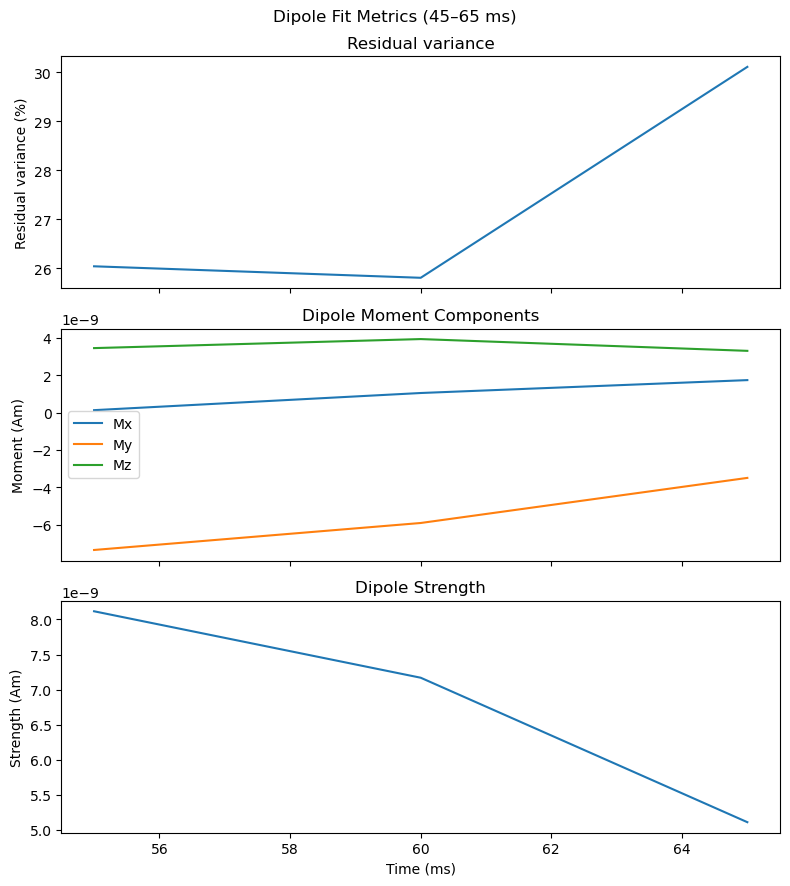

Another useful diagnostic is to assess how well the predicted activity pattern at the scalp generated by the dipole model corresponds to the actual data. 

The code below will calculate that for you. 
```{python}
fwd, stc = mne.make_forward_dipole(
    dipole_mag_early,
    meg_head_model,
    mag_evo_early.info,
    trans,
)

pred_evoked = mne.simulation.simulate_evoked(
    fwd,
    stc,
    mag_evo_early.info,
    cov=ad_hoc_cov,
    nave=np.inf,
)

best_idx = np.argmax(dipole_mag_early.gof)
best_time = dipole_mag_early.times[best_idx]

diff = mne.combine_evoked([mag_evo_early, pred_evoked], weights=[1, -1])

fig, axes = plt.subplots(
    nrows=1,
    ncols=4,
    figsize=[10.0, 3.4],
    gridspec_kw=dict(width_ratios=[1, 1, 1, 0.1], top=0.85),
    layout="constrained",
)

plot_params = dict(
    times=best_time,
    ch_type="mag",
    outlines="head",
    colorbar=False,
    show=False,
)

mag_evo_early.plot_topomap(
    time_format="Measured field",
    axes=axes[0],
    **plot_params,
)

pred_evoked.plot_topomap(
    time_format="Predicted field",
    axes=axes[1],
    **plot_params,
)

plot_params["colorbar"] = True
diff.plot_topomap(
    time_format="Difference",
    axes=axes[2:],
    **plot_params,
)

fig.suptitle(
    f"Measured vs predicted field at {best_time * 1000:.1f} ms",
    fontsize=14,
)

plt.show()
```


> **Question 4.2:** Give your interpretation o fthe dipole diagnostics.

## Two-dipole models
Do a dipole fit again for the late ERF component by changing the cropping of `mag_evo` to `mag_evo.crop(0.115, 0.130)` and rerun the code.

Plot measures versus predicted topographies again. See if you get something similar to result below:

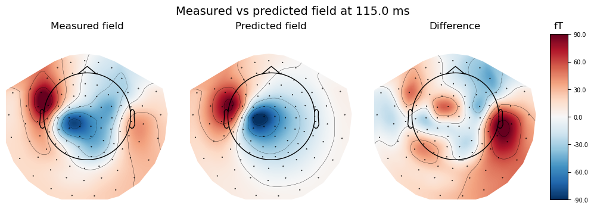

The residual activity hint that there might be an ipsilateral dipole. 

To do a two dipole model, MNE uses a version of beamformers (we'll cover those in tutorial 5) called rap_music or trap_music. They use the same modeling framework, but trap_music is "truncated", hence the 't' added to rap_music. We're going to use trap_music for our two dipole modeling. 

Unlike how single dipole modeling didn't require a forward model, we do have to provide a premade forward model for this calculation. You can load one in you made previously, or recalculate it.

### Create a forward model
Forward models are an important concept in source reconstruction. For any given source (a grid point inside the brain) it is calculated how each sensor (magnetometer, gradiometer or electrode) sees (how much T, T/m or V would it pick up) a source with unit strength (1 nAm). One might say that it says: "For a given source, if it is active, how would the different sensors see it. The term forward model is interchangable with leadfield in MEG/EEG literature, but leadfield is the engineering term and can technically refer to any kind of map of source activation. 

We define the forward model for both MEG and EEG (magnetometers/gradiometers and electrodes). To create the forward model, we first need to create a source space. The source space is out model of where the sources that generate the measured signals (potentially) can come from. How we define the source space determines our source reconstruction. We further assume that the dipole(s) can be anywhere in the brain. We will, therefore, create an evenly spaced grid as our source space and then calculate the forward model for the points in the grid. 

In MNE-Python, this happens in two steps. First you define the source space with `mne.setup_volume_source_space`, defining the subject, the distance between points, the Freesurfer file locations, and the head model that matches your data type. 

Then, call `mne.make_forward_solution` and fill in the other required parameters: an info object for your data, the trans file we defined when prepping the MRI, the source space, the head model, and then specify if its MEG or EEG with `meg= True` or `eeg= True`.

These steps will create a grid around the brain and estimate the forward solution for each of the grid points in the brain. 

```{python}
Replace filename to match your forward solution.
meg_fwd = mne.read_forward_solution(join(output_path, 'tactile_stim_ds200Hz-meg-fwd.fif'))
```
OR

```{python}
meg_src = mne.setup_volume_source_space(subject=subject, 
                                    pos=5, 
                                    subjects_dir=subjects_dir_path, 
                                    bem=meg_head_model)

meg_fwd = mne.make_forward_solution(
    info= evo[3].info,
    trans= trans,
    src= meg_src,
    bem= meg_head_model,
    meg= True,
    eeg= False  
)

eeg_src = mne.setup_volume_source_space(subject=subject, 
                                    pos=5, 
                                    subjects_dir=subjects_dir_path, 
                                    bem=eeg_head_model)

eeg_fwd = mne.make_forward_solution(
    info= evo[3].info,
    trans= trans,
    src= eeg_src,
    bem= eeg_head_model,
    meg= False,
    eeg= True  
)
mne.viz.plot_bem(subject=subject, subjects_dir=subjects_dir_path, src=eeg_src)

```
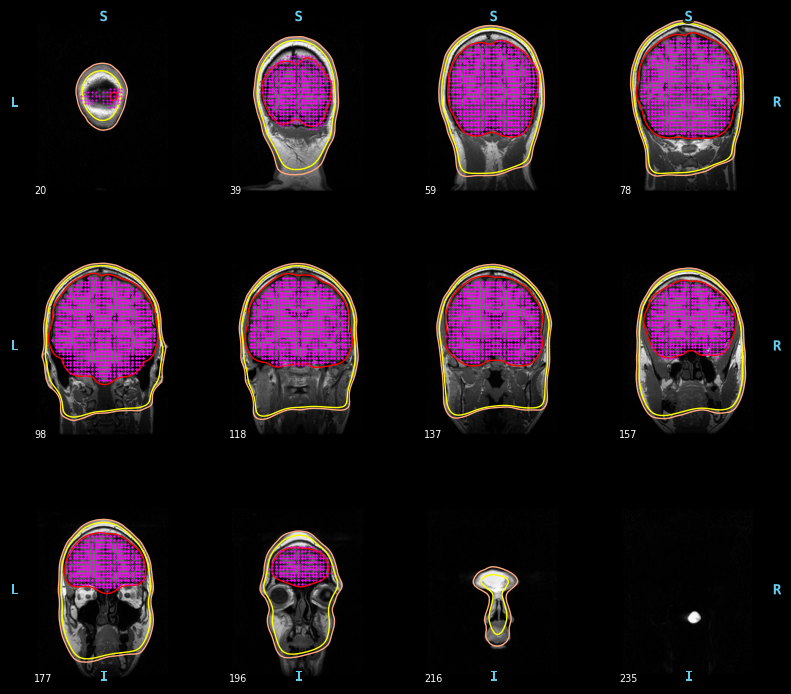

Now that we have our forward solution, we can calculate our two dipole model. We crop our evoked potential to just our timepoint of interest (remember: we'll get a fit for the activity every 5 ms) and then calculate our two dipole model. You could specify any number of dipoles with `n_dipoles`, but for our purposes we only need two.

```{python}
mag_evo = evo[3].copy().pick('mag')
mag_evo_late = mag_evo.crop(0.115, 0.130)

dipoles, residual = mne.beamformer.trap_music(
    mag_evo_late, meg_fwd, ad_hoc_cov, n_dipoles=2, return_residual=True
)
```
Visualize the results of our two dipole modeling. 
```{python}
mne.viz.plot_dipole_locations(dipoles, trans, "170424", subjects_dir=subjects_dir_path, mode='outlines')
```
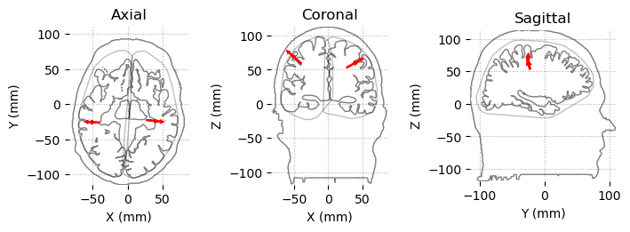

## Compare dipole fits for electrodes, magnetometers, and gradiometers
In the following section, you find code that do the dipole fits as above but will loop over all sensor types (magnetometers, gradiometers, and electrodes) and all five experimental conditions (i.e. stimulations on the five fingers on the right hand) for the early and late ERF components.

This will take a WHILE to run. 

```{python}
# Plotting of all the dipole fits
#set up
early_latency = (0.045, 0.065)
late_latency  = (0.115, 0.130)

fingers = [
    "little finger",
    "ring finger",
    "middle finger",
    "index finger",
    "thumb",
]

dipoles_mag_early = []
dipoles_grad_early = []
dipoles_eeg_early = []

dipoles_mag_late = []
dipoles_grad_late = []
dipoles_eeg_late = []

for evoked in evo:

    # -------------------------
    # EARLY: single dipole over time
    # -------------------------

    # MAGNETOMETERS
    dip_mag, res_mag = mne.fit_dipole(
        evoked.copy().pick("mag"),
        cov=ad_hoc_cov,
        bem=meg_head_model,
        trans=trans
    )

    # pick best time point in window
    mask = (dip_mag.times >= early_latency[0]) & (dip_mag.times <= early_latency[1])
    idx = np.where(mask)[0][np.argmax(dip_mag.gof[mask])]

    dipoles_mag_early.append((dip_mag, idx))


    # GRADIOMETERS
    dip_grad, res_grad = mne.fit_dipole(
        evoked.copy().pick("grad"),
        cov=ad_hoc_cov,
        bem=meg_head_model,
        trans=trans
    )

    mask = (dip_grad.times >= early_latency[0]) & (dip_grad.times <= early_latency[1])
    idx = np.where(mask)[0][np.argmax(dip_grad.gof[mask])]

    dipoles_grad_early.append((dip_grad, idx))


    # EEG
    dip_eeg, res_eeg = mne.fit_dipole(
        evoked.copy().pick("eeg"),
        cov=ad_hoc_cov,
        bem=eeg_head_model,
        trans=trans
    )

    mask = (dip_eeg.times >= early_latency[0]) & (dip_eeg.times <= early_latency[1])
    idx = np.where(mask)[0][np.argmax(dip_eeg.gof[mask])]

    dipoles_eeg_early.append((dip_eeg, idx))


    # -------------------------
    # LATE: TRAP-MUSIC (2 dipoles)
    # -------------------------

    # MAG
    dip_mag_l, _ = mne.beamformer.trap_music(
        evoked.copy().pick("mag").crop(*late_latency),
        forward=meg_fwd,
        noise_cov=ad_hoc_cov,
        n_dipoles=2
    )
    dipoles_mag_late.append(dip_mag_l)

    # GRAD
    dip_grad_l, _ = mne.beamformer.trap_music(
        evoked.copy().pick("grad").crop(*late_latency),
        forward=meg_fwd,
        noise_cov=ad_hoc_cov,
        n_dipoles=2
    )
    dipoles_grad_late.append(dip_grad_l)

    # EEG
    dip_eeg_l, _ = mne.beamformer.trap_music(
        evoked.copy().pick("eeg").crop(*late_latency),
        forward=eeg_fwd,
        noise_cov=ad_hoc_cov,
        n_dipoles=2
    )
    dipoles_eeg_late.append(dip_eeg_l)
```
## Plot EARLY dipoles
Now plot the results for the early dipoles for comparison.

```{python}
# MAGNETOMETERS
for (dip, idx), finger in zip(dipoles_mag_early, fingers):

    t = dip.times[idx]
    dip_one = dip.copy().crop(tmin=t, tmax=t)

    mne.viz.plot_dipole_locations(
        dipoles=dip_one,
        trans=trans,
        subject=subject,
        subjects_dir=subjects_dir_path,
        mode="outlines",
        show_all=True,
        title=f"{finger} ({t*1000:.1f} ms) - MAG"
    )

# GRADIOMETERS
for (dip, idx), finger in zip(dipoles_grad_early, fingers):

    t = dip.times[idx]
    dip_one = dip.copy().crop(tmin=t, tmax=t)

    mne.viz.plot_dipole_locations(
        dipoles=dip_one,
        trans=trans,
        subject=subject,
        subjects_dir=subjects_dir_path,
        mode="outlines",
        show_all=True,
        title=f"{finger} ({t*1000:.1f} ms) - GRAD"
    )


# EEG
for (dip, idx), finger in zip(dipoles_eeg_early, fingers):

    t = dip.times[idx]
    dip_one = dip.copy().crop(tmin=t, tmax=t)

    mne.viz.plot_dipole_locations(
        dipoles=dip_one,
        trans=trans,
        subject=subject,
        subjects_dir=subjects_dir_path,
        mode="outlines",
        show_all=True,
        title=f"{finger} ({t*1000:.1f} ms) - EEG"
    )
```
As an example: Dipole EARLY for mag, grad, and eeg for the INDEX finger. 


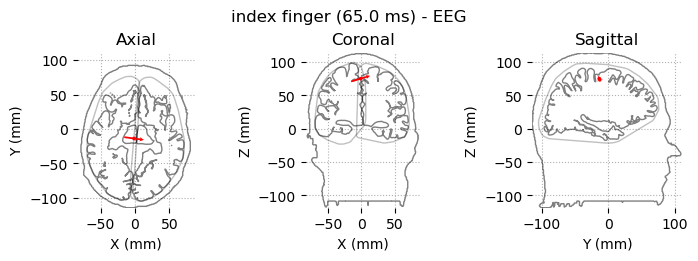

Dipole EARLY for mag, grad, and eeg for the THUMB

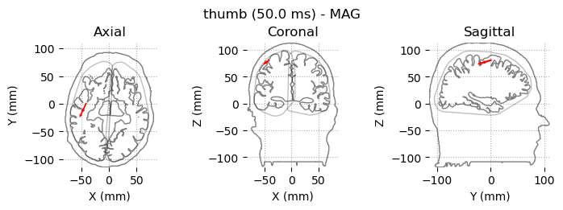
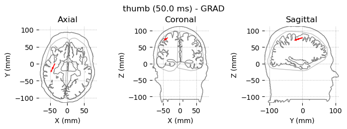
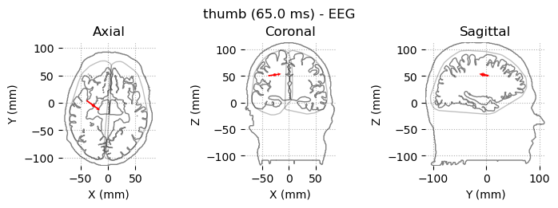

Are you seeing a pattern? 

## Plot LATE dipoles
```{python}
# MAGNETOMETERS
for dip, finger in zip(dipoles_mag_late, fingers):

    mne.viz.plot_dipole_locations(
        dipoles=dip,
        trans=trans,
        subject=subject,
        subjects_dir=subjects_dir_path,
        mode="outlines",
        show_all=True,
        title=f"{finger} (115–130 ms) - MAG"
    )

#GRADIOMETERS
for dip, finger in zip(dipoles_grad_late, fingers):

    mne.viz.plot_dipole_locations(
        dipoles=dip,
        trans=trans,
        subject=subject,
        subjects_dir=subjects_dir_path,
        mode="outlines",
        show_all=True,
        title=f"{finger} (115–130 ms) - GRAD"
    )

#EEG
for dip, finger in zip(dipoles_eeg_late, fingers):

    mne.viz.plot_dipole_locations(
        dipoles=dip,
        trans=trans,
        subject=subject,
        subjects_dir=subjects_dir_path,
        mode="outlines",
        show_all=True,
        title=f"{finger} (115–130 ms) - EEG"
    )
```
As an example: Dipole LATE for mag, grad, and eeg for the INDEX finger. 

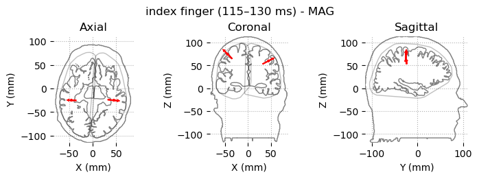
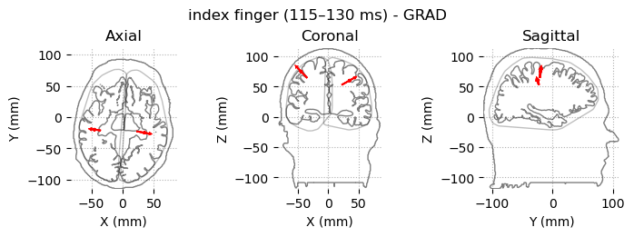
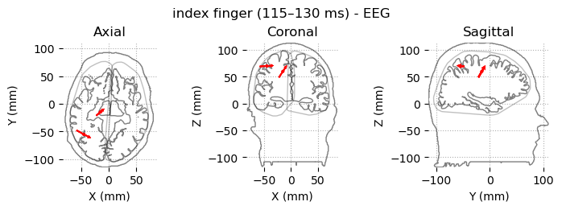

Dipole LATE for mag, grad, and eeg for the THUMB. 

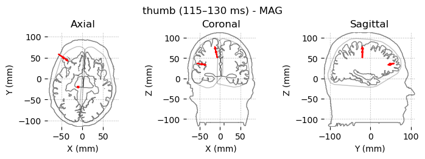
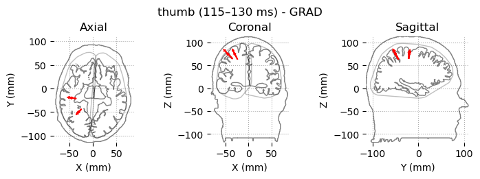
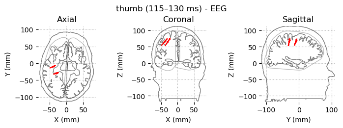

We can see that the two dipoles are not really doing a good job of describing the later components of this response. It seems like the index finger is well-characterized by the mag and grad dipole calculations, but not by eeg. And the thumb is not well localized with any of them! Often if you think you would have more than one dipole, it's better practice to choose a distributed source method (like MNE-- tutorial 4b). 

## End of Tutorial 4a

You now are able to use dipole fits to reconstruct the source of the evoked response at different time periods. The next tutorial will cover how to use the Minimum Norm Estimate method when you think the source could be from more than one location at the same time. 