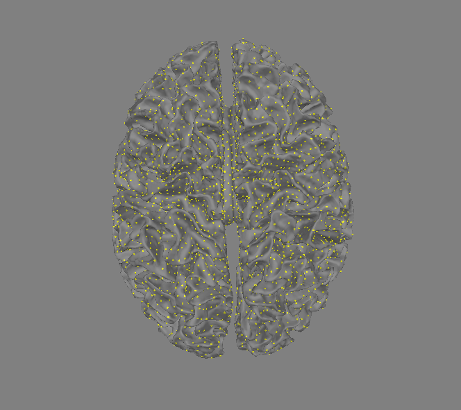
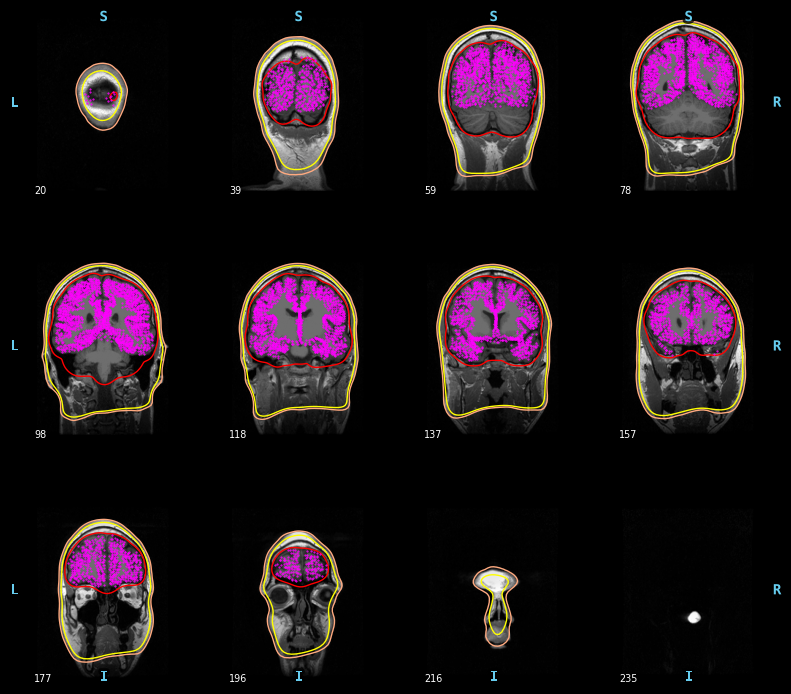
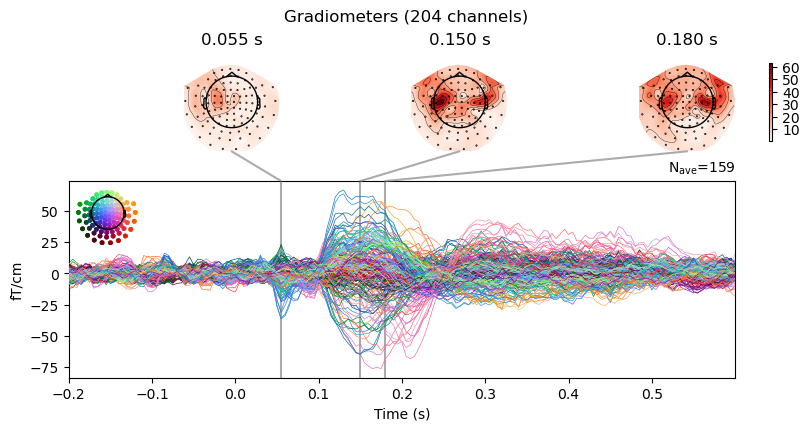
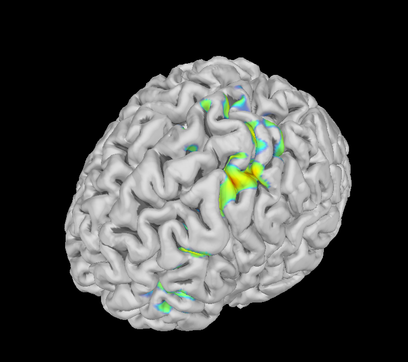
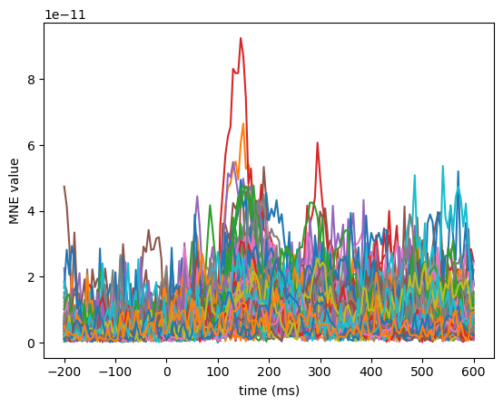

# Dev Notes
Make sure the file names are descriptive enough to refer back to later; get the leadfield from dipole fitting with a good name

# Minimum-Norm Estimate (MNE)
In this tutorial, you will do source reconstruction with Minimum-Norm Estimates (MNE). This method is related to dipole fits but more advanced in that it assumes dipoles distributed equally over the cortex that all, to some extent, are active at any point in time.

The steps for MNE source reconstruction are:
1. Create a surface source model.
2. Create head model and forward solution.
3. Do inverse modelling
4. Evaluate outcome.

The first step is the most time consuming, it takes up to 10 hours to run, and is not covered in the main tutorial (but take a look at Tutorial 99 to see how it can be done). Instead, you should load the already preprocessed files and then do the source reconstruction.

## Import Modules and setting up paths
Change these to appropriate paths for your operating system and setup

```{python}
import mne
from os.path import join
import matplotlib.pyplot as plt

# define paths

# project_path = join(expanduser('~'), 'courses/meeg_course_mne') # Change to match your project path
# meg_path = join(project_path, '../data')   # Change to match your data path
# figs_path = join(project_path, 'figs')

show_plots = True # Change to True to open plots in browser

#%% Define subject paths and list of all subjects/session

subjects_and_dates = [
    'NatMEG_0177/170424/'  # Add more subjects as you like, separate with comma    
    ]
           
# Define where to put output data
output_path = join(meg_path, subjects_and_dates[0], 'MEG')
subjects_dir = join(meg_path, subjects_and_dates[0], 'freesurfer_subjects')
```

## Load in preprocessed data and models
In previous tutorials we have prepared and cleaned evoked data, created a head model to work with MEG, and defined the `trans` file to align our MRI and MEG data. Now we load all of those files for use in this tutorial. If you had more than one subject, you would have to loop through these files as well to have each analysis be personalized to the subject.

```{python}
evo_path = join(output_path, 'tactile_stim_ds200Hz-clean-ica-ave.fif')
evo = mne.read_evokeds(evo_path)

#head model
meg_bem_path= join(output_path, '170424-meg-bem-sol.fif')
meg_head_model = mne.read_bem_solution(meg_bem_path)

# transform file
trans_file = join(output_path, "tactile_stim_ds200Hz-clean-ica-epo-trans.fif") 
trans = mne.read_trans(trans_file)

#freesurfer subject
subject= '170424'
```
Note: When you import evoked objects without specifying which event type you want, it imports them all as a list. From here on out, we use `evo[3]` to refer to the index finger event evoked potential.


## Compute the cortical source space
We use the Freesurfer preparation that was included in the course materials to make the source space.

```{python}
# may take a little bit
src = mne.setup_source_space(
    subject=subject, 
    spacing='oct6', 
    subjects_dir=subjects_dir
)

src.save(join(output_path, '170424-cortical-oct-6-src.fif'))
```
Now, we can visual the source model. It should look like a brain surface!

```{python}
src.plot(subjects_dir=subjects_dir, trans=trans)
```


Each point on the brain represents a dipole in the MNE source reconstruction.

> **Question 4.3:** How many dipoles will the MNE source reconstruction contain?

## Verify alignment of MRI and src
Your MRI and src should already be aligned, but we can check by plotting them together.

```{python}
mne.viz.plot_bem(subject=subject, subjects_dir=subjects_dir, src=src)
```


## Make forward model
Now we can make the forward model for the source reconstruction. 

For this tutorial, we will use the stimulation of the index finger, corresponding to index 3 in the evoked list.

```{python}
mne_fwd = mne.make_forward_solution(
    evo[3].info, 
    trans=trans,
    src=src,
    bem=meg_head_model,
    meg=True,
    eeg=False,
    mindist=5.0
)

mne.write_forward_solution(join(output_path, 'tactile_stim_ds200Hz-meg-oct-6-mne-fwd.fif'), mne_fwd)
```
### Compare with the volumetric source space and forward solution we made in the dipole fitting tutorial 
> Wants a visualized cloud of points for comparison

## Make an ad hoc covariance for our solutions
There are multiple methods to make a noise covariance matrix for source localization. In this tutorial, we will just do an ad hoc covariance calculation. It assumes a reasonable level of noise, but isn't tied to the data.

```{python}
ad_hoc_cov = mne.make_ad_hoc_cov(evo[3].info)
```
## Inverse Solution
### Start with the inverse operator
The inverse operator sets up the formula and variables that will be used to calculate the inverse solution in the next step. It's separate to allow for reuse of the same operator on multiple conditions or time windows. 

For this calculation, we're only going to look at the gradiometers in our MEG data.

```{python}
evoked_grad = evo[3].copy().pick('grad')
noise_cov_grad = ad_hoc_cov.copy().pick_channels(evoked_grad.ch_names)

inverse_operator = mne.minimum_norm.make_inverse_operator(
    evoked_grad.info,
    forward=mne_fwd,
    noise_cov=noise_cov_grad,
    loose=0.2, 
    depth=0.8
)
```
The parameters `loose` and `depth` define what kind of assumptions the model makes about what sources it sees. 

`Loose` defines whether we are assuming our sources have only one component normal to the cortical surface (`loose=0`) or if they can be be in any orientation and have three components (`loose=1`). `loose 0.2` assumes that normal components are the most influential (since we're looking at MEG), but that we should consider some deviation from other components.

`Depth` defines how heavily our operator is weighting deeper sources. MNE has a bias toward more superficial sources (even a bias to gyral crowns versus sulcal walls!), so we have to add an extra parameter to make sure our sources are considered equally. The `depth` parameter can take a value between 0 and 1, with 0.8 being a standard default correction. `depth=0.8` is enough of a correction to reduce the superficial bias, but doesn't strongly amplify noise in the data, like `depth=1` can.

```{python}
# Save the operator
mne.minimum_norm.write_inverse_operator(
    "tactile_stim_ds200Hz-meg-oct-6-grad-mne-inv.fif", inverse_operator
)
```
### Now apply the inverse operator to our data of interest
```{python}
method = "MNE"
snr = 3.0 
lambda2 = 1.0 / snr**2
stc, residual = mne.minimum_norm.apply_inverse(
    evoked_grad,
    inverse_operator,
    lambda2,
    method=method,
    pick_ori=None,
    return_residual=True
)
```
Look at the structure of `stc`.
> **Question 4.4:** What is in the output structure? What are the dimensions of the data and what do they represent?

```{python}
# Save data
stc.save(join(output_path, 'tactile_stim_ds200Hz-meg-grad-mne'))
```
## Visualize MNE source reconstruction results
### Identify points of interest

Plot the MNE source reconstruction on the grid. The `stc` structure contains values for all grid points and all time points. To visualize the source reconstruction on the grid, we need to decide what time points to plot.

From previous tutorials, you probably have some points of interest in mind, but let's look at the evoked plot again. Feel free to change the times to look at the topographies of other time points.

```{python}
times = (0.055, 0.150, .180)
evo[3].plot_joint(times=times, picks='grad')
```


Use what we've learned to think about what the sources might look like at the timepoints you've selected.

### View points of interest

The following plotting method has many parameters that you can change to create a visualization that looks good to you. For example, to look at just one timepoint, you can use `time_viewer=False` (`time_viewer=True` will let you scroll over the whole evoked length) in the following method. Let's look at a time period you thought looked interesting from the previous step. 

```{python}
stc.plot(
    subject=subject,
    subjects_dir=subjects_dir,
    hemi='both',
    surface='pial',
    time_viewer=False,
    initial_time=0.053,   
    colormap='jet',       
    colorbar=False,
    src=src       
)
```



> **Question 4.5:** At a glance, where do you see activated sources? How many different cortical patches are "active" at this time point (Note: your visualization might look different depending on your processing or plotting specifications)

This image shows a single time point for all estimated sources. Each source (i.e., each grid-point on the cortical surface) has a time series of activation. You can in principle treat each source as its own "channel" -- you can view the activation of all sources over time, analogous to the activation in MEG or EEG channels. Here we plot source activation across time (only plotting 1/100 of the sources for clarity)

```{python}
fig, ax = plt.subplots()
ax.plot(1e3 * grad_stc.times, grad_stc.data[::100, :].T)
ax.set(xlabel="time (ms)", ylabel=f"{method} value")
```



Now, let's view the time course as an animation. Again, there are many parameters you can change to have an animation that looks much different. For an example, try out different numbers for`smoothing_steps`. How does it change the visualization?

```{python}
grad_stc.plot(
    subjects_dir=subjects_dir,
    initial_time=0,
    time_viewer=True,
    hemi='both',
    surface='pial',
    smoothing_steps=3,
    src=src
)
```

While in the visualization window, experiment with the different color limits and surface types.

It is difficult to answer what type of source model and source reconstruction method that is better. The matter model depends on the question you want to answer and the kind of signal you are interested in for the particular answer. For example, if you know that a focal patch of cortex generates the signal, then a single dipole model might be sufficient, and you do not gain extra information by including the entire cortex. Similar, if we know that the process we are interested in requires distributed sources, then it is not valid to assume that a single dipole is sufficient.

> **Question 4.6:** In your question document, include two pictures. The first should be of a time point where a dipole model could be sufficient for characterizing the activity. The second should be a time period where a distributed model is better.

## End of Tutorial 4b

This tutorial demonstrates how to do MNE source reconstruction. Compared to the dipole (and beamformer, as you will see later) it differs in how to prepare the source model because of the assumptions behind MNE. But the additional assumption means that MNE is a quite robust source reconstruction method.