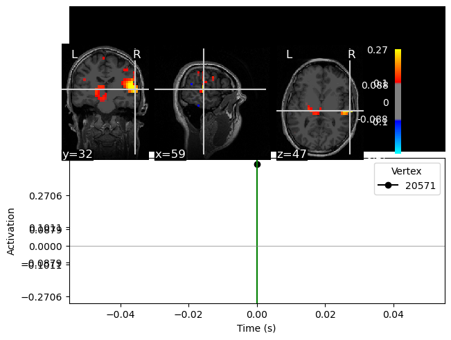
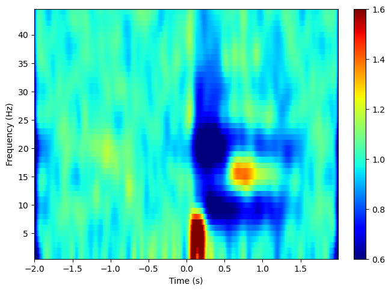
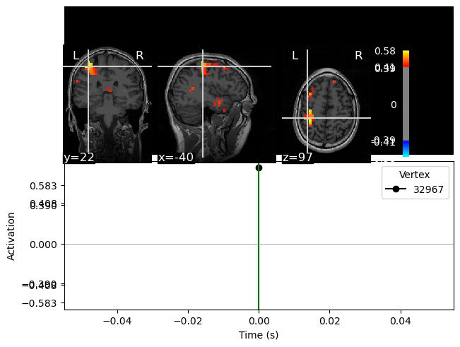
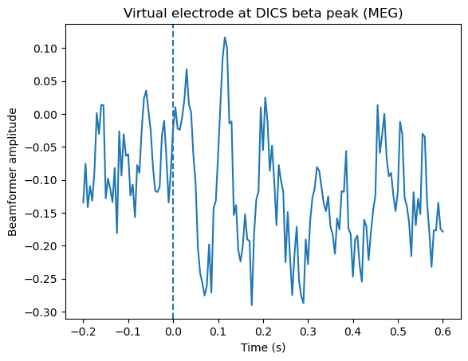
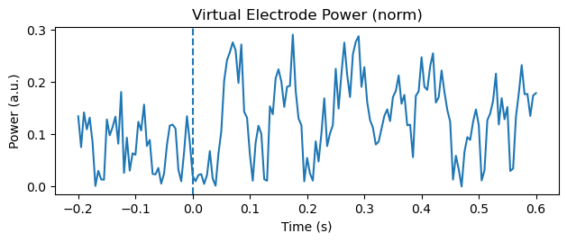

# Beamformer Source Analysis
In this tutorial, we will do various forms of beamformer methods for source reconstructions. The beamformer is a spatially adaptive filter that allows us to estimate the amount of activity at any given location in the brain. The inverse filter is based on minimizing the source power (or variance) at a given location, subject to unit-gain constraint. Unit-gain constraint means that, if a source had the power of amplitude 1 and was projected to the sensors by the lead field, the inverse filter applied to the sensors should then reconstruct power of amplitude one at that location.

First, we need to prepare the raw data, define a source model, calculate the forward solution, and calculation some covariance matrices.

## Import modules and set up paths
Change these to appropriate paths for your operating system and setup.

```{python}
# Import Modules and setting up paths
import mne
import mne.bem
import os
from os.path import join, exists
import numpy as np
import matplotlib.pyplot as plt
import numpy as np

# define paths

project_path = "/Users/erin.noelle.mahan/Library/CloudStorage/OneDrive-KarolinskaInstitutet/Documents/MEG_Course_MNE"
meg_path = join(project_path, 'TutorialDataset') 
figs_path = join(project_path, 'figs')

show_plots = True # Change to True to open plots in browser

#%% Define subject paths and list of all subjects/session

subjects_and_dates = [
    'NatMEG_0177/170424/'  # Add more subjects as you like, separate with comma    
    ]
           
# Define where to put output data
output_path = join(meg_path, subjects_and_dates[0], 'MEG')
mri_path = join(meg_path, subjects_and_dates[0], 'MRI')
subjects_dir = join(meg_path, subjects_and_dates[0], 'freesurfer_subjects')
subject= '170424'
```
## Load files necessary for the beamforming
We are loading four different files here:

We are loading the head model for the MEG data
We are loading the head model for the EEG data
We are loading the pre-processed data on which we will do the actual source reconstruction

If you saved the files from the preprocessing tutorial, head model tutorial, and evoked analysis tutorial, you should load those files. 
```{python}
#load relevant files
#evokeds
evo_path = join(output_path, 'tactile_stim_lp70Hz_ds200Hz-clean-ica-ave.fif')
evo = mne.read_evokeds(evo_path)
# when you import evoked objects without specifying which event type you want, it imports them all as a list

epo_path= join(output_path, 'tactile_stim_lp70Hz_ds200Hz-clean-ica-epo.fif')
epo = mne.read_epochs(epo_path)

#head models

eeg_bem_path = join(output_path, '170424-eeg-bem-sol.fif')
eeg_head_model = mne.read_bem_solution(eeg_bem_path)

meg_bem_path= join(output_path, '170424-meg-bem-sol.fif')
meg_head_model = mne.read_bem_solution(meg_bem_path)

# transform file
trans_file = join(output_path, "tactile_stim_ds200Hz-clean-ica-epo-trans.fif") 
trans = mne.read_trans(trans_file)
```

## Create forward models
Create a grid around the brain and estimate the forward model for each of the grid points in the brain.

For any given source (a grid point inside the brain) it is calculated how each sensor (magnetometer, gradiometer or electrode) sees (how much T, T/m or V would it pick up) a source with unit strength (1 nAm). One might say that it says: "For a given source, if it is active, how would the different sensors see it"

Always check that your source space is aligned!

```{python}
# one source space for MEG and EEG
src = mne.setup_volume_source_space(subject=subject, 
                                    pos=5, 
                                    subjects_dir=subjects_dir, 
                                    bem=meg_head_model,
                                    mri='T1.mgz',
                                    )

mne.viz.plot_bem(subject=subject,
                 subjects_dir=subjects_dir,
                 src=src,
                 trans=trans,
                 mri='T1.mgz')

meg_fwd = mne.make_forward_solution(
    info= evo[3].info, 
    trans= trans,
    src= src,
    bem= meg_head_model,
    meg= True,
    eeg= False  
)
```
## Make noise and data covariance calculations 
Before, we made a covariance matrix using ad hoc covariance that assumes some amoutn of noise in the data, but isn't tied to the data itself. Now, we will use a covariance matrix calculated from different data sections depending on what kind of covariance we are looking for. 

A data covariance matrix tells us about what our singal (+ noise) looks like when we're trying to fit a beamformer to it. Conversely, the noise covariance is useful for whitening the data and improving the SNR as it tells the algorithms what you're not interested in. 

In this tutorial, we are using a time period that includes our signal of interest for the data covariance and the baseline, pre-stimulus period for our noise covariance. We use `rank='info'` because our data was MaxFiltered after acquisition which reduces the rank from what MNE-Python assumes it is (it assumes that it's the number of sensors).

Then we plot it for teaching and understanding purposes.
```{python}
data_cov = mne.compute_covariance(epo, tmin=.075, tmax=.225, rank='info', method='auto')
noise_cov = mne.compute_covariance(epo, tmin=None, tmax=0, rank='info', method='auto')
data_cov.plot(epo.info)
```

## Beamformer in time-domain (LCMV)
For our first beamformer source reconstruction, we will select the time evoked response from 100 ms to 200 ms (you can always play around with what time to select). Make sure to include your data and noise covariance matrices from before! 

Here we also select only the index finger `evo[3]` and only the MEG sensors. 

We are making a type of beamformer called Least Constraints Minimum Variance (LCMV).

### Make the filters
```{python}
meg_evo = evo[3].copy().pick('meg')

filters = mne.beamformer.make_lcmv(meg_evo.info,
                                   forward=meg_fwd,
                                   data_cov=data_cov,
                                   reg=0.05,
                                   noise_cov=noise_cov,
                                   pick_ori='max-power',
                                   rank='info')
```
The above function only creates the filters that are then applied to the data. It has a lot of parameters that we are specifying (and even more than we aren't). `reg=0.05` is a parameter that helps smooth the data so the filters don't overfit to noise that we aren't interested in.  `pick_ori='max-power` is a parameter that defines the source orientations that are of interest to you. `max-power` says "choose whatever orientation that gives the max power". Other options include "vector" that gives an x, y, and z component at each source and "normal" that only keeps components that are normal to the cortical surface. 

### Apply the filters
```{python}
stc = mne.beamformer.apply_lcmv(meg_evo, filters=filters)

stc.plot(src=src, subject=subject, subjects_dir=subjects_dir)
```
> **Question 5.1:** Give your interpretation of the source plot.

## Beamformer contrasts
The centre of the head bias means that the source reconstructions in themselves are not readily interpretable. To compensate, we will calculate a contrast between the time of interest and a baseline period. However, to avoid bias between the two different beamformer source reconstructions due to different filters, we create a common filter consisting of a data segment that contains both time-windows

```{python}
#crop the data, select only thumb
stim_epo = epo['Thumb'].copy().crop(tmin=.100, tmax=0.200)
baseline_epo = epo['Thumb'].copy().crop(tmin=-0.200, tmax=-0.100)
combo_epo = epo['Thumb'].copy().crop(tmin=-0.200, tmax=0.200)

stim_epo.pick('meg')
baseline_epo.pick('meg')
combo_epo.pick('meg')

stim_evo = stim_epo.average()
baseline_evo = baseline_epo.average()
combo_evo = combo_epo.average()
```

We also need covariance matrices for the contrasting beamformer that have the specific data and baseline period's we're looking fr. 

```{python}
contrast_data_cov = mne.compute_covariance(stim_epo, tmin=.100, tmax=.200, rank='info', method='auto')
contrast_noise_cov = mne.compute_covariance(baseline_epo, tmin=None, tmax=-.100, rank='info', method='auto')
```

Then do the LCMV source inversion. We are not interested in the source reconstruction as such. We only use this part to calculate the beamformer filter, that we then will apply separately to the stimulation data in baseline data. 

```{python}
contrast_filters = mne.beamformer.make_lcmv(combo_evo.info,
                                   forward=meg_fwd,
                                   data_cov=contrast_data_cov,
                                   reg=0.05,
                                   noise_cov=contrast_noise_cov,
                                   pick_ori='max-power',
                                   rank='info')
```
> **Question 5.2:** Explore what is in the `contrast_filters`structure and then explain what it contains. 

Now, apply the filters to the covariance matrices. This application of the filters on the covariance will not provide a time course; it yields one power value per vertex of our src.  

```{python}
source_base = mne.beamformer.apply_lcmv_cov(contrast_noise_cov, filters=contrast_filters)
source_stim = mne.beamformer.apply_lcmv_cov(contrast_data_cov, filters=contrast_filters)
```
Once we have our two source estimates made with the same filters (make sure you used the same filters!) we can compare the stimulation data to the baseline data. Once you calculate `source_contrast.data` you can plot it onto the subject's MRI.

```{python}
source_contrast = source_stim.copy()
source_contrast.data = (source_stim.data - source_base.data) / (source_base.data)
source_contrast.plot(src=src, subject=subject, subjects_dir=subjects_dir)
```


> If the plot layout looks a little strange (but looks like the one pictured above), that's correct! MNE just has some quirks in plotting that aren't easy to solve.

## Frequency-Domain Beamformer
In the next part, we will do source reconstruction of time-frequency data with a beamformer method known as Dynamic Imaging of Coherent Sources (DICS).

We will start by finding a time-frequency area of interest that want to know the underlying sources. From time-domain data, we will calculate the cross-spectral density of the frequency (or frequencies) of interest and then use the cross-spectral density to find the underlying sources. We will focus here on reconstructing the activity underlying the beta rebound.

1. We crop the data to find the period of interest (690 to 970 msec).
2. We define a baseline period of the same duration. We will compare the period of interest against this since the power estimates that the beamformer results in are not informative in themselves.



## Prepare epochs
Feel free to change the period of interest to match whatever looks best for your data. We're looking at the beta rebound that should be somewhere between 500-1000 msec and 12-18 Hz. If you change the window, make sure both the baseline and the stim are the same length

We're going to repeat the combination of time-windows of interest just like in the previous contrast.

```{python}
#crop the data, select only thumb
rebound_toi_epo = epo['Thumb'].copy().crop(tmin=.690, tmax=0.970)
baseline_toi_epo = epo['Thumb'].copy().crop(tmin=-0.500, tmax=-0.220)
combined_tois_epo = epo['Thumb'].copy().crop(tmin=-0.500, tmax=0.970)
```
# Make Cross Spectral Densities
Now that we have our time-windows of interest, we can compute the cross-spectral densities for each of our epoch objects. This is like how we made the covariance matrices earlier for our LCMV filter creations. 

We could have chosen a different type of CSD calculation (such as morlet wavelet analysis) or selected a different set of frequencies. It all depends on your data and what you're looking for. In this case, we have a narrow frequency band and a long enough time window, so fourier can work. 

Fourier-based CSD requires that the time window is long enough to resolve the frequency band of interest (Remember when we talked about what parts of time-frequency analyses can be interpretted because of the time required for a full cycle?). If the window is too short, you may get errors or unreliable estimates.

```{python}
csd_combo= mne.time_frequency.csd_fourier(combined_tois_epo, fmin=14, fmax=16)
csd_baseline = mne.time_frequency.csd_fourier(baseline_toi_epo, fmin=14, fmax=16)
csd_rebound = mne.time_frequency.csd_fourier(rebound_toi_epo, fmin=14, fmax=16)
```
Now that we have our CSDs for all of the frequencies we selected, we can average them to get the average CSD for our frequency band.

```{python}
csd = csd.mean()
csd_baseline = csd_baseline.mean()
csd_rebound = csd_rebound.mean()
```

## Create and apply DICS beamformer
With all of our different pieces, we now have what we need to calculate the DICS filters that we will apply. 

```{python}
dics_filters = mne.beamformer.make_dics(info=epo.info, 
                                        forward=meg_fwd, 
                                        csd=csd, 
                                        noise_csd=csd_baseline, 
                                        pick_ori='max-power', 
                                        rank='info')
```

With this filter, we can now apply it to the data that we're interested in analyzing: the rebound and baseline tois.

```{python}
baseline_source_power, freqs = mne.beamformer.apply_dics_csd(csd=csd_baseline, filters=dics_filters)
rebound_source_power, freqs = mne.beamformer.apply_dics_csd(csd=csd_rebound, filters=dics_filters)
```

Because we want to see the contrast between the baseline and the beta rebound, we have to calcualte the difference between the rebound and baseline and then divide it by the baseline. Just like before!

Then plot the results
```{python}
stc = (rebound_source_power - baseline_source_power) / baseline_source_power
brain = stc.plot(
    src=src,
    subjects_dir=subjects_dir,
    subject=subject
)
```


> **Question 5.3:** Explain how you would interpret the new image that you have created.

## Use beamformers to make a "virtual electrode"
Virtual electrodes are a useful tool to get time-series "as if" we had recorded data from a given site in the brain and if we do not want to deal with source data from the whole volume, e.g. if we have hypotheses about specific regions of interest.

For the last beamformer application, we will create a virtual electrode in the point that showed the largest power for the beta rebound as identified above.

```{python}
pos, _ = stc.get_peak()
```
Now that we have our position, we follow a very similar process from making LCMV filters before.

Select the time period that you wish to make a virtual electrode for.

```{python}
thumb_epo = epo['Thumb'].copy().crop(-.200, .600)
thumb_epo.pick('meg')
thumb_evo = thumb_epo.average()
```
Make your covariance matrices.

```{python}
thumb_data_cov = mne.compute_covariance(thumb_epo, tmin=0, tmax=.600, rank='info', method='auto')
thumb_noise_cov = mne.compute_covariance(thumb_epo, tmin=None, tmax=0, rank='info', method='auto')
```
Make and apply your LCMV filters. However, this time we're applying them to the epochs, so we have single trial data for our virtual electrode.

```{python}
lcmv_filters = mne.beamformer.make_lcmv(thumb_epo.info,
                                   forward=meg_fwd,
                                   data_cov=thumb_data_cov,
                                   reg=0.05,
                                   noise_cov=thumb_noise_cov,
                                   pick_ori='max-power',
                                   rank='info')

stcs_lcmv = mne.beamformer.apply_lcmv_epochs(thumb_epo, lcmv_filters)
```
Now that we have the stc for each epoch, we can use the position of the maximum we identified earlier to create our virtual electrode. 

```{python}
ve = []

for stc in stcs_lcmv:
    n_lh = len(stc.vertices[0])

    if pos in stc.vertices[0]:
        idx = list(stc.vertices[0]).index(pos)
        tc = stc.data[idx, :]
    elif pos in stc.vertices[1]:
        idx = list(stc.vertices[1]).index(pos)
        tc = stc.data[n_lh + idx, :]
    else:
        raise RuntimeError("Peak vertex not found in this STC.")

    ve.append(tc)

ve = np.array(ve)   # shape: (n_epochs, n_times)
```
The data in the "virtual electrode" is now equivalent to the epoched data. We can now apply all the same types of analyses that we would do to our sensor-level data, e.g. calculate evoked responses or TFR. The "virtual electrode" approach can be thought of as a preprocessing step

Try to calculate the evoked response in the virtual sensor:
```{python}
# virtual electrode amplitude over time
ve_mean = ve.mean(axis=0)

plt.plot(thumb_epo.times, ve_mean)
plt.axvline(0, linestyle="--")
plt.xlabel("Time (s)")
plt.ylabel("Beamformer amplitude")
plt.title("Virtual electrode at DICS beta peak")
plt.show()

# Virtual electrode power over time
mn = np.abs(ve_mean)

plt.subplot(2, 1, 2)
plt.plot(thumb_epo.times, mn)
plt.axvline(0, linestyle="--")
plt.xlabel("Time (s)")
plt.ylabel("Power (a.u.)")
plt.title("Virtual Electrode Power (norm)")

plt.tight_layout()
plt.show()
```



> **Question 5.4:** The procedure to create a "virtual channel" is the same for magnetometers and EEG electrodes (though the actual calculation "under the hood" is different). Repeat the procedure to calculate the virtual electrode, but this time for the EEG data. Change the `thumb_epo.pick()` to `eeg` and make sure you're using an EEG forward model. You can read in one that you've saved before or make a new one. 
>
>```{python}
> eeg_fwd = mne.make_forward_solution(
>    info=evo[3].info,
>    trans=trans,
>    src=src,
>    bem=eeg_head_model,
>    meg=False,
>    eeg=True
> )
>```
> In order to do inverse modeling on our EEG data, we have to set the average reference to act as a projector instead of being applied directly to the data. Ensure you have done that prior to applying the filters to your epochs or it will throw an error!
>
>```{python}
> thumb_epo.set_eeg_reference('average', projection=True)
>```
>
> How does the virtual channel estimated from the EEG electrodes compare the virtual channel estimated from the gradiometers and why might this be? (You're welcome to include your plot if that would be helpful for explaining.)

## End of Tutorial 5
Beamformers offers a variety of methods to analyse MEG (and to some extend EEG) data. You can use it to localize responses in the data, localize specific oscillatory activity, or to "reconstruct" signals as if they were measured at a given location. In the next tutorial, we will also look at how beamformers can be used in connectivity analysis.