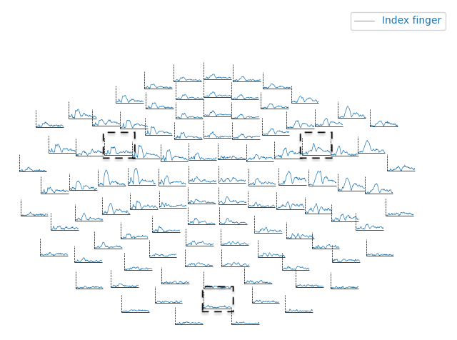
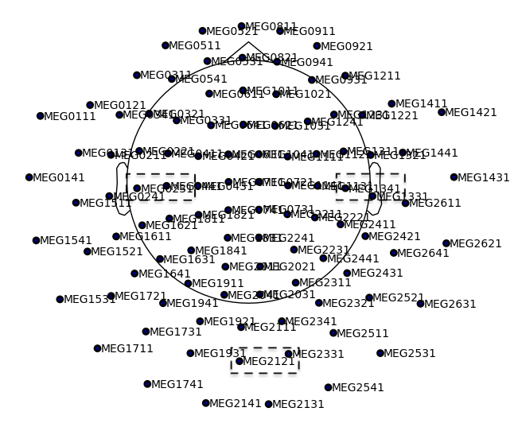
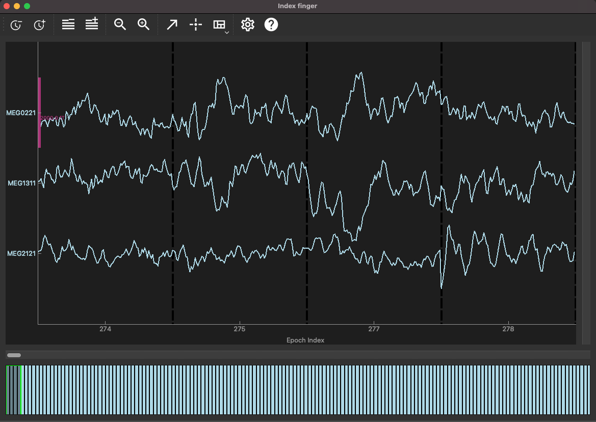
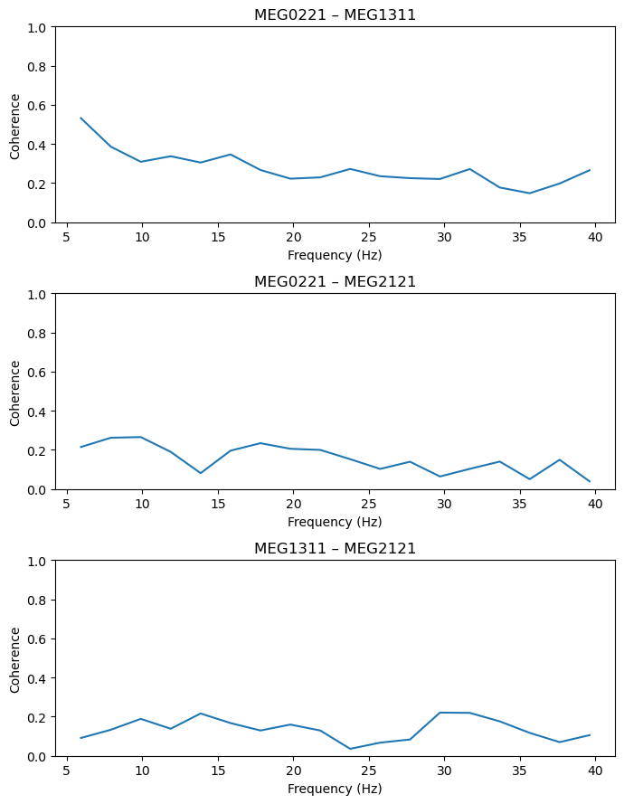
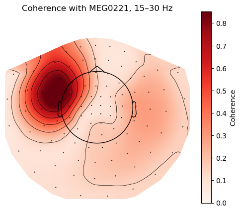
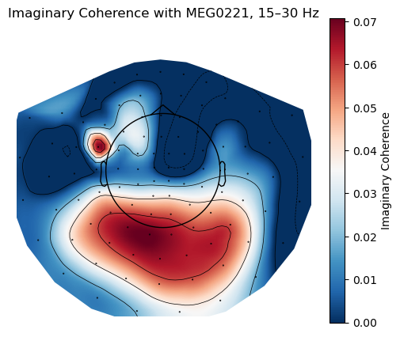
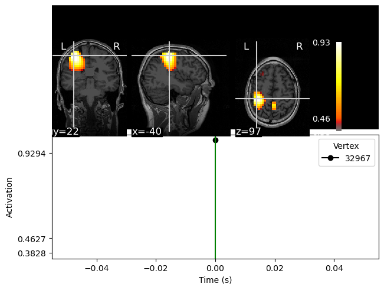
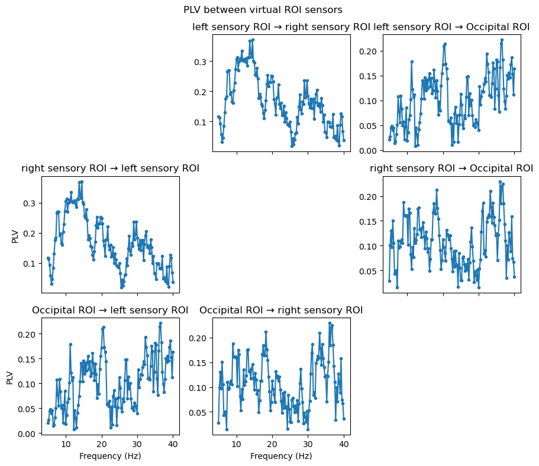

# Connectivity
In this tutorial you will do three connectivity analyses. Connectivity is a broad topic. In short, we are looking for statistical dependence between signals; what is often called functional connectivity. MEG and EEG are perfect methods to study connectivity as the temporal dynamics allows for estimation of various statistical measurements of dependence between signals. While it is relatively simple to apply and calculate various connectivity measures to MEG/EEG data, it is, however, far from trivial to just look for dependencies in MEG/EEG signals. Spurious connections may arise from trivial issues, such as field spread. General considerations when doing connectivity analysis with MEG/EEG is whether you are in source- or sensor-space and what connectivity measure that you use, and what the combination of the two say about your signals and then in the end, how the signals relate to processes in brain or cognition.

This tutorial does not offer definite answers to the problems. The tutorial is designed to outline various strategies for calculating connectivity with MEG/EEG signals. It is a demonstration of how it can be done. The tutorial is divided into three parts:

1. Sensor-level connectivity
2. Source-level connectivity
3. ROI-based connectivity

## Download and import MNE-Connectivity
```{python}
import sys
!{sys.executable} -m pip install mne-connectivity
```

## Import modules and set up paths
```{python}
# Import Modules and setting up paths
import mne
from os.path import join
import numpy as np
import matplotlib.pyplot as plt
import numpy as np
import mne_connectivity
import itertools

# define paths 

project_path = "/Users/erin.noelle.mahan/Library/CloudStorage/OneDrive-KarolinskaInstitutet/Documents/MEG_Course_MNE"
meg_path = join(project_path, 'TutorialDataset') 
figs_path = join(project_path, 'figs')

show_plots = True # Change to True to open plots in browser

#%% Define subject paths and list of all subjects/session

subjects_and_dates = [
    'NatMEG_0177/170424/'  # Add more subjects as you like, separate with comma    
    ]
           
# Define where to put output data
output_path = join(meg_path, subjects_and_dates[0], 'MEG')
mri_path = join(meg_path, subjects_and_dates[0], 'MRI')
subjects_dir = join(meg_path, subjects_and_dates[0], 'freesurfer_subjects')
subject= '170424'

#load relevant files

epo_path= join(output_path, 'tactile_stim_lp70Hz_ds200Hz-clean-ica-epo.fif')
epo = mne.read_epochs(epo_path)

#head models

eeg_bem_path = join(output_path, '170424-eeg-bem-sol.fif')
eeg_head_model = mne.read_bem_solution(eeg_bem_path)

meg_bem_path= join(output_path, '170424-meg-bem-sol.fif')
meg_head_model = mne.read_bem_solution(meg_bem_path)

# transform file
trans_file = join(output_path, "tactile_stim_ds200Hz-clean-ica-epo-trans.fif") 
trans = mne.read_trans(trans_file)
```
## Sensor-level connectivity
First, we will look at connectivity between three selected channels and then look at all-to-all connectivity between channels.

Start with data we've loaded and select parts of the signals in which we will calculate connectivity. The code below selects data for the index finger stimulation (trigger = 8) in the time window, applies a baseline before cropping using the pre-stimulus time period, then crops from 0 ms to 500 ms after the stimulation. Then estimate the evoked response with averaging.
```{python}
# select just index 
index_epo = epo['Index finger']
# make evoked 
index_epo.apply_baseline((None, 0))
index_crop = index_epo.copy().crop(0, 0.500)
index_evo = index_crop.average()
```
Plot the data so you can find three channels to compare. We want to select channels that show significant evoked responses and one that doesn't show that much activity. 

```{python}
index_evo.plot_topo(merge_grads=True)
index_evo.plot_sensors(show_names=True)
```



(It's a bit hard to see, but try your best!)

Based on the visual inspection above, I have chosen three channels that roughly are located above the left- and right sensory areas and one sensor towards the bach above the occipital areas.

Write the sensors you pick in an array. Note that the results of the following steps will be different if you pick another set of sensors. But that is fine!

```{python}
#sensor selection
sensors = ['MEG0221', 'MEG1311', 'MEG2121']
```
Then select the data from only those three channels with `.pick()`. You can inspect your selection with `.plot()` like usual.
```{python}
slct_epo = index_crop.copy().pick(sensors)

slct_epo.plot()
```


For the first connectivity estimation, we will calculate the coherence between the three channels. Coherence between signals is estimated by calculating the cross-spectral density (CSD) between the signals and dividing by the power spectral densities (PSD) of the signals. Coherence is a measure in the frequency-domain and is calculated for each frequency bin.

In MNE-Python, you can specify how you want the CSD calculated, the frequencies of interest, and method within one function call: `mne_connectivity.spectral_connectivity_epochs()`

```{python}
slct_coh = mne_connectivity.spectral_connectivity_epochs(
    slct_epo,
    method="coh",        # there are many options here, but we picked coherence for this tutorial
    mode="fourier",      # processes the epochs with a fourier transform
    fmin=5,
    fmax=40,
    faverage=False,      # keep individual frequency bins
    names=slct_epo.ch_names,
    n_jobs=1
)
```
Let's visualize the coherence between these three selected channels:
```{python}
pairs = list(itertools.combinations(range(len(ch_names)), 2))

fig, axes = plt.subplots(len(pairs), 1, figsize=(7, 3 * len(pairs)))

if len(pairs) == 1:
    axes = [axes]

for ax, (i, j) in zip(axes, pairs):
    y = coh[j, i, :]   # note reversed order

    ax.plot(freqs, y)
    ax.set_ylim(0, 1)
    ax.set_xlabel("Frequency (Hz)")
    ax.set_ylabel("Coherence")
    ax.set_title(f"{ch_names[i]} – {ch_names[j]}")

plt.tight_layout()
plt.show()
```


> **Question 6.1:** The coherence results only show 3 traces. Would there still only be three if we used a measure such as Granger causality? 

We are not limited to estimating connectivity between only a few sensors. For the next part, we calculate the coherence between all sensors. First, select one sensor that will be the reference sensor. This is not a reference in the same sense as the reference for EEG. Here it means the sensor that we use to calculate coherence between this sensor and all other sensors; i.e. one-to-all connectivity. Sometimes this is also called the "seed".

As before, choose a sensor that shows a strong evoked response. We are also going to prepare the data that we want to compare. Here we only want to compare the reference sensor to the magnetometers; if we don't specify, the calculation will compare every combination of channels which would likely be too intensive to run within a reasonable timeframe.

```{python}
ref_chan = "MEG0221"
mag_epo = index_crop.copy().pick('mag')
ref_idx = mag_epo.ch_names.index(ref_chan)

target_idx = np.array([
    i for i in range(len(mag_epo.ch_names))
    if i != ref_idx
])

indices = (
    np.repeat(ref_idx, len(target_idx)),
    target_idx,
)
```
Now, do the connectivity analysis. We specify the method `'coh'` and mode `'fourier'` just like before. However, now we specify the indices of the channels we want to compare.

```{python}
coh_meg = mne_connectivity.spectral_connectivity_epochs(
    mag_epo,
    method="coh",
    mode="fourier",
    indices=indices,
    sfreq=mag_epo.info["sfreq"],
    fmin=2,
    fmax=40,
    faverage=False,
)
```
Now let's visualize the results. We can specify a band if we want. Here we just see the beta band.
```{python}
freqs = np.asarray(coh_meg.freqs)
con_data = coh_meg.get_data()  # n_connections × n_freqs

# choose frequency band to show, e.g. beta
band = (15, 30)
band_mask = (freqs >= band[0]) & (freqs <= band[1])

values = con_data[:, band_mask].mean(axis=1)

# one value per magnetometer
topo_values = np.zeros(len(mag_epo.ch_names))
topo_values[target_idx] = values

# leave seed visible, or mark it separately
topo_values[ref_idx] = np.nanmax(values)

vmax = np.nanmax(topo_values)

fig, ax = plt.subplots(figsize=(6, 5))
im, cn = mne.viz.plot_topomap(
    topo_values,
    mag_epo.info,
    axes=ax,
    show=False,
    vlim=(0, vmax),
    sensors=True,
    contours=6,
)

ax.set_title(f"Coherence with {ref_chan}, {band[0]}–{band[1]} Hz")
fig.colorbar(im, ax=ax, label="Coherence")
plt.show()
```


You might notice that the high coherence values tend to cluster around the channel that you selected as the seed?

Try another connectivity measrue: the imaginary part of the coherence:

```{python}
imcoh_meg = mne_connectivity.spectral_connectivity_epochs(
    mag_epo,
    method="imcoh",     # the method has changed now
    mode="fourier",
    indices=indices,
    sfreq=mag_epo.info["sfreq"],
    fmin=2,
    fmax=40,
    faverage=False,
)
```
Plot as before with the beta band selected again.
```{python}
freqs = np.asarray(imcoh_meg.freqs)
con_data = imcoh_meg.get_data()  # n_connections × n_freqs

# choose frequency band to show, e.g. beta
band = (15, 30)
band_mask = (freqs >= band[0]) & (freqs <= band[1])

values = con_data[:, band_mask].mean(axis=1)

# one value per magnetometer
topo_values = np.zeros(len(mag_epo.ch_names))
topo_values[target_idx] = values

# leave seed visible, or mark it separately
topo_values[ref_idx] = np.nanmax(values)

vmax = np.nanmax(topo_values)

fig, ax = plt.subplots(figsize=(6, 5))
im, cn = mne.viz.plot_topomap(
    topo_values,
    mag_epo.info,
    axes=ax,
    show=False,
    vlim=(0, vmax),
    sensors=True,
    contours=6,
)

ax.set_title(f"Imaginary Coherence with {ref_chan}, {band[0]}–{band[1]} Hz")
fig.colorbar(im, ax=ax, label="Imaginary Coherence")
plt.show()
```


> **Question 6.2:** Explain the differences between the two topographies.

### Coherence with EEG
For EEG, the procedure is the same. The only thing you have to change is the channel selection and the channel combinations:
```{python}
eeg_ref_chan = "EEG032"
eeg_epo = index_crop.copy().pick('eeg')
eeg_ref_idx = eeg_epo.ch_names.index(eeg_ref_chan)

eeg_target_idx = np.array([
    i for i in range(len(eeg_epo.ch_names))
    if i != ref_idx
])

eeg_indices = (
    np.repeat(eeg_ref_idx, len(eeg_target_idx)),
    eeg_target_idx,
)

coh_eeg = mne_connectivity.spectral_connectivity_epochs(
    eeg_epo,
    method="coh",
    mode="fourier",
    indices=eeg_indices,
    sfreq=eeg_epo.info["sfreq"],
    fmin=2,
    fmax=40,
    faverage=False,
)
```
Plot just like before!

```{python}
# coh_eeg was computed from eeg_epo with:
# indices = (np.repeat(ref_idx, len(target_idx)), target_idx)

freqs = np.asarray(coh_eeg.freqs)
con_data_eeg = coh_eeg.get_data()  # n_connections × n_freqs

# choose frequency band to show, e.g. beta
band = (15, 30)
band_mask = (freqs >= band[0]) & (freqs <= band[1])

values = con_data_eeg[:, band_mask].mean(axis=1)

# one value per magnetometer
topo_values = np.zeros(len(eeg_epo.ch_names))
topo_values[eeg_target_idx] = values

# leave seed visible, or mark it separately
topo_values[eeg_ref_idx] = np.nanmax(values)

vmax = np.nanmax(topo_values)

fig, ax = plt.subplots(figsize=(6, 5))
im, cn = mne.viz.plot_topomap(
    topo_values,
    eeg_epo.info,
    axes=ax,
    show=False,
    vlim=(0, vmax),
    sensors=True,
    contours=6,
)

ax.set_title(f"Coherence with {eeg_ref_chan}, {band[0]}–{band[1]} Hz")
fig.colorbar(im, ax=ax, label="Coherence")
plt.show()
```

## Whole-brain connectivity with DICS
The beamformer method Dynamic Imaging of Coherent Sources (DICS) is based on calculating the CSD to calculate the inverse model. It can, therefore, be used to calculate the coherence between sources in the brain when doing the source inversion. The procedure is almost identical to what you did in the beamformer tutorial.

First, set up the source space and forward solution. Either recreate them or load them in.
```{python}
src = mne.setup_volume_source_space(subject=subject, 
                                    pos=5, 
                                    subjects_dir=subjects_dir, 
                                    bem=meg_head_model,
                                    mri='T1.mgz',
                                    )

meg_fwd = mne.make_forward_solution(
    info= index_crop.info,
    trans= trans,
    src= src,
    bem= meg_head_model,
    meg= True,
    eeg= False  
)
```
We're going to use only grads for this calculation and compute the rank of our data before making our DICS.
```{python}
grad_epo = index_crop.copy().pick('grad')

rank = mne.compute_rank(grad_epo)
```
Now we compute the cross-spectral density around 20 Hz and take the mean. In MNE, you can only apply DICS filters to epochs when there's only one frequency in the CSD. Hence taking the mean around our frequency of interest.
```{python}
csd_20 = mne.time_frequency.csd_fourier(
    grad_epo,
    fmin=18,
    fmax=22,
    tmin=0.0,
    tmax=0.5,
    picks="grad"
).mean()

dics_filters = mne.beamformer.make_dics(
    grad_epo.info,
    forward=meg_fwd,
    csd=csd_20,
    reg=0.05,
    pick_ori="max-power",
    depth=1.0,
    real_filter=True,
    rank=rank
)
```
Now you can apply your DICS filters to your epochs with `apply_dics_epochs()`. 
```{python}
stc_power = mne.beamformer.apply_dics_epochs(grad_epo, dics_filters, return_generator=False)
```

Like before, we're going to specify a 'seed index'. (Think about how computationally expensive it would be to calculate the connectivity between all source locations to all other source locations!) We're going to use the peak vertex that was identified in the beamformer tutorial. This is vertex 32967.

Once we specify the seed index and the sources we want to calculate connectivity with, we can call `spectral_connectivity_epochs()`.

```{python}
source_data = np.array([stc.data for stc in stc_power])

vertices = stc_power[0].vertices[0]
seed_vertex = 32967
seed_idx = np.where(vertices == seed_vertex)[0][0]
print("Seed index:", seed_idx)

n_sources = source_data.shape[1]

indices = (
    np.repeat(seed_idx, n_sources),
    np.arange(n_sources),
)

con = mne_connectivity.spectral_connectivity_epochs(
    source_data,
    method="coh",
    mode="fourier",
    sfreq= grad_epo.info["sfreq"],
    fmin=18,
    fmax=22,
    faverage=True,
    indices=indices,
    verbose=True,
)
```
Visualize the results.

```{python}
coh_values = con.get_data().squeeze()

coh_stc = stc_power[0].copy()
coh_stc.data = coh_values[:, np.newaxis]
coh_stc.tmin = 0.0
coh_stc.tstep = 1.0

coh_stc.plot(
    src=src,
    subject=subject,
    subjects_dir=subjects_dir
)
```


> **Question 6.3:** Explain the result.

## Connectivity between ROI
Connectivity analyses can easily lead to many connectivitions being estimated, which leads to a multiple comparison problem. A solution to deal with this is to narrow the connectivity analysis to pre-specified regions of interest, e.g. specific point on the cortex.

In the following part, I have chosen three points in the brain defined by the coordinates below corresponding to points in left- and right primary-sensory cortex and V1/V2. You can take a look at the DICS figure above and find your own coordinates to use if you want.

```{python}
roi_left_cm = np.array([-4, 1, 11])
roi_right_cm = np.array([4, 1, 12])
roi_occipital_cm = np.array([-2, -8, 6])

roi_coords_m = np.vstack([roi_left_cm, roi_right_cm, roi_occipital_cm]) / 100.0
roi_names = ["left sensory ROI", "right sensory ROI", "Occipital ROI"]
```
We'll do some set up to make sure we have all the different variables we'll need. 

```{python}
index_grad = index_epo.copy().pick('grad')

index_grad_cov = mne.compute_covariance(index_epo.pick('grad'), tmin=None, tmax=None, method="auto")

grad_chan = index_epo.pick('grad').ch_names

fwd_grad = mne.pick_channels_forward(meg_fwd, include=grad_chan)

grad_rank = mne.compute_rank(index_grad)
```
Start by making the LCMV filters, applying them, and then make the virtual channel data from the calculated stcs. 

```{python}
lcmv_filters = mne.beamformer.make_lcmv(
    index_grad.info,
    forward=fwd_grad,
    data_cov=index_grad_cov,
    reg=0.05,
    pick_ori="vector",
    rank=grad_rank
)

grad_stcs = mne.beamformer.apply_lcmv_epochs(index_grad, lcmv_filters, return_generator=False)

src = fwd_grad["src"]

vertno = src[0]["vertno"]
src_rr = src[0]["rr"][vertno]

roi_vertex_info = []

for coord in roi_coords_m:
    idx = np.argmin(np.linalg.norm(src_rr - coord, axis=1))
    roi_vertex_info.append(vertno[idx])

roi_vertex_info
virt_data = np.zeros((len(grad_stcs), len(roi_names), len(index_grad.times)))

for ri, vertex in enumerate(roi_vertex_info):

    # collect vector data for this ROI across epochs
    roi_vec = []

    for stc in grad_stcs:
        v_idx = np.where(stc.vertices[0] == vertex)[0][0]
        roi_vec.append(stc.data[v_idx, :, :])  # shape: 3 x n_times

    roi_vec = np.asarray(roi_vec)  # n_epochs x 3 x n_times

    # find one consistent dominant orientation for this ROI
    X = roi_vec.transpose(1, 0, 2).reshape(3, -1)
    u, s, vh = np.linalg.svd(X, full_matrices=False)
    ori = u[:, 0]

    # project vector source estimate onto that signed orientation
    virt_data[:, ri, :] = np.einsum("eot,o->et", roi_vec, ori)
```
Now we have the virtual data we can calculate the connectivity between each of our ROIs.
```{python}
n_rois = len(roi_names)

seeds = []
targets = []

for i in range(n_rois):
    for j in range(n_rois):
        if i != j:
            seeds.append(i)
            targets.append(j)

seeds = np.array(seeds)
targets = np.array(targets)

virt_plv = mne_connectivity.spectral_connectivity_epochs(
    virt_data,
    names=roi_names,
    method="plv",
    indices=(seeds, targets),
    mode="multitaper",
    mt_adaptive=False,
    sfreq=index_grad.info["sfreq"],
    fmin=5,
    fmax=40,
    faverage=False,
    n_jobs=1,
)

freqs = np.asarray(virt_plv.freqs)
plv_arr = virt_plv.get_data()  # shape: n_connections x n_freqs

plv_mat = np.zeros((n_rois, n_rois, len(freqs)))

for conn_idx, (s, t) in enumerate(zip(seeds, targets)):
    plv_mat[s, t, :] = plv_arr[conn_idx, :]

fig, axes = plt.subplots(
    n_rois,
    n_rois,
    figsize=(9, 8),
    sharex=True,
    sharey=False,
)

for ii, name_i in enumerate(roi_names):
    for jj, name_j in enumerate(roi_names):
        ax = axes[ii, jj]

        if ii == jj:
            ax.axis("off")
            continue

        y = plv_mat[ii, jj, :]

        ax.plot(freqs, y, marker=".")
        ax.set_title(f"{name_i} → {name_j}")

        if jj == 0:
            ax.set_ylabel("PLV")
        if ii == n_rois - 1:
            ax.set_xlabel("Frequency (Hz)")

fig.suptitle("PLV between virtual ROI sensors")
fig.tight_layout()
```


## End of Tutorial 6
This tutorial has only scratched the surface of the various ways to calculate connectivity in MEG/EEG. However, the example code above can easily be changed to other connectivity measures. If you want, try to change the method parameter when calling spectral_connectivity_epochs. 